# DKASC Alice Springs 光伏气象特征分析报告

## 1. 项目背景

本分析服务于 Capstone 项目中的“基于天气大数据的新能源 / 光伏发电量预测”模块。研究目标不是单纯训练一个预测模型，而是围绕以下问题展开：

> 哪些气象变量对 DKASC Alice Springs 光伏功率预测影响最大？

本报告基于 DKASC Alice Springs 单站点与聚合站点数据开展初步分析。结论主要适用于该站点和当前所选时间范围，不能直接泛化到所有地区或所有类型的光伏系统。

## 2. 数据集说明

本项目使用三个 DKASC Alice Springs 数据文件：

| 数据文件 | 数据含义 | 本次用途 |
|---|---|---|
| `91-Site_DKA-M9_B-Phase.csv` | 1A Trina, 10.5kW, mono-Si, Dual, 2009 | 主 PV 标签 |
| `96-Site_DKA-MasterMeter1.csv` | 0 263.0kW, Total of all sites | 可选聚合 PV 标签，目前只做符号诊断 |
| `101-Site_DKA-WeatherStation.csv` | Historical Weather Data | 气象特征 |

主预测标签使用 `91-Site_DKA-M9_B-Phase.csv` 中的 `Active_Power` 字段。天气数据包含温度、相对湿度、风速、风向、降雨、水平辐照度和倾斜面辐照度等字段。三个文件的主要时间间隔均为 5 minutes。

## 3. 方法设计

### 3.1 数据预处理

分析流程首先解析并统一 `timestamp`，随后按时间戳将 PV 标签与 WeatherStation 气象数据对齐。原始 CSV 文件不被移动或覆盖，清洗后的数据保存到 `data/processed/`。

主要质量控制包括：

- 删除无法解析的时间戳和重复时间戳；
- 对 `Active_Power < 0` 的主 PV 标签标记为异常；
- 对超过 10.5kW 系统容量 1.2 倍的功率值进行异常检查；
- 对负辐照度、异常湿度、异常风向、负风速、负降雨等进行检查；
- 天气字段允许短间隔插值，目标变量不插值。

建模和特征重要性分析使用 daylight subset，即辐照度高于阈值的白天样本；完整日周期可视化保留全天样本。这样可以避免夜间大量 0 输出对相关性和 MAPE 产生过强干扰。

### 3.2 特征工程

本分析构建了以下特征组：

| 特征类型 | 代表字段 |
|---|---|
| 时间特征 | `hour`, `month`, `day_of_year`, `sin_hour`, `cos_hour`, `sin_day_of_year`, `cos_day_of_year` |
| 辐照度特征 | `Global_Horizontal_Radiation`, `Diffuse_Horizontal_Radiation`, `Radiation_Global_Tilted`, `Radiation_Diffuse_Tilted` |
| 温度特征 | `Weather_Temperature_Celsius` |
| 湿度特征 | `Weather_Relative_Humidity` |
| 风场特征 | `Wind_Speed`, `Wind_Direction`, `wind_direction_sin`, `wind_direction_cos` |
| 降雨特征 | `Weather_Daily_Rainfall`, `rain_indicator` |

其中，风向属于角度变量，因此使用 sin/cos 编码，以避免 0 度和 360 度在数值上被错误地视为相距很远。

### 3.3 特征评估方法

为了回答“哪些气象变量最重要”，本项目结合了统计方法和模型方法：

- Pearson correlation；
- Spearman correlation；
- Mutual information；
- Random Forest feature importance；
- Permutation importance；
- Feature group ablation。

模型部分使用 Ridge Regression 作为线性 baseline，Random Forest Regressor 作为非线性主模型。数据集按时间顺序进行 chronological split，不随机打乱，以避免时间泄漏。

### 3.4 消融实验

消融实验用于比较不同特征组对预测性能的贡献：

| 实验组 | 特征组合 |
|---|---|
| `baseline_time_only` | 仅时间特征 |
| `baseline_irradiance_only` | 仅辐照度特征 |
| `time_plus_irradiance` | 时间 + 辐照度 |
| `time_irradiance_temperature` | 时间 + 辐照度 + 温度 |
| `time_irradiance_humidity` | 时间 + 辐照度 + 湿度 |
| `time_irradiance_wind` | 时间 + 辐照度 + 风场 |
| `time_irradiance_rainfall` | 时间 + 辐照度 + 降雨 |
| `full_weather` | 所有天气特征 |

评估指标包括 MAE、RMSE、MAPE 和 R2。由于夜间和接近 0 的 PV output 会导致 MAPE 不稳定，MAPE 主要在 daylight 样本上解释。

## 4. 结果分析

### 4.1 数据概况

`1A Trina` 主标签文件覆盖 2013-08-14 至 2025-08-23，原始记录约 125 万行。WeatherStation 文件覆盖 2008-09-12 至 2025-08-23，原始记录约 176 万行。两个数据源的典型采样间隔均为 5 minutes。

主系统质量检查发现：

- 负功率样本约 14,085 条；
- 未发现超过 12.6 kW 的异常高功率样本；
- 湿度、风向和少量辐照度字段存在异常值，需要在正式建模前处理。

这些检查结果说明数据整体可用于分析，但仍包含传感器异常、夜间行为和局部缺失等问题。

### 4.2 相关性分析

daylight 样本下，辐照度变量与 PV 输出的相关性最强：

| 特征 | Pearson 相关系数 | Spearman 相关系数 |
|---|---:|---:|
| `Radiation_Global_Tilted` | 约 0.796 | 约 0.794 |
| `Global_Horizontal_Radiation` | 约 0.786 | 约 0.787 |
| `Weather_Relative_Humidity` | 约 -0.364 | 约 -0.318 |
| `Wind_Speed` | 约 0.324 | 约 0.356 |
| `Weather_Temperature_Celsius` | 约 0.243 | 约 0.250 |

结果符合光伏发电物理机制：辐照度是 PV output 的直接驱动因素；湿度和降雨往往与云量、大气衰减有关，因此与输出呈负相关；风速可能通过组件冷却带来一定正向影响。

### 4.3 特征重要性

Random Forest feature importance 显示，`Radiation_Global_Tilted` 是最重要的特征，其次是 `Global_Horizontal_Radiation`。Permutation importance 也给出了相同方向的结论，说明该结果不是单一指标造成的偶然现象。

综合相关性、互信息、模型重要性和消融实验，当前最重要的特征大致可以排序为：

1. 倾斜面总辐照度；
2. 水平总辐照度；
3. 时间 / 季节性特征；
4. 风速与风向；
5. 湿度；
6. 温度；
7. 降雨。

需要注意的是，温度与 PV 输出之间的关系并不总是简单负相关。虽然高温会降低组件效率，但在真实观测数据中，高温也常常与晴天和强辐照度同时出现，因此统计相关性可能表现为正相关。这也是需要使用消融和模型方法辅助解释的原因。

### 4.4 消融实验结果

消融实验表明，仅使用时间特征或仅使用辐照度特征都能提供一定预测能力，但二者结合更稳定。加入风场特征后，测试集 RMSE 进一步下降，说明风速和风向在该站点可能具有额外解释力。

当前 test split 中，`time_irradiance_wind` 和 `full_weather` 的表现接近，且优于简单的 `time_plus_irradiance`。这说明完整天气特征可以提供增益，但主要贡献仍来自辐照度，其他变量更多是补充信息。

### 4.5 模型表现

Random Forest 在 validation split 上表现较好：

| 模型 | Split | MAE | RMSE | R2 |
|---|---|---:|---:|---:|
| Ridge | validation | 约 1.206 | 约 1.554 | 约 0.583 |
| Random Forest | validation | 约 1.029 | 约 1.475 | 约 0.624 |
| Ridge | test | 约 2.150 | 约 2.330 | 约 -1.969 |
| Random Forest | test | 约 2.109 | 约 2.375 | 约 -2.084 |

测试集 R2 为负，说明最后 15% 时间段与训练阶段存在明显分布差异。可能原因包括系统状态变化、维护记录缺失、传感器漂移、季节覆盖差异或后期数据质量变化。因此，本项目当前结果更适合作为特征影响分析与方法验证，而不是最终生产级预测模型。

### 4.6 Total of all sites 诊断

`96-Site_DKA-MasterMeter1.csv` 暂未作为正式标签建模。符号诊断显示：

| 样本范围 | 正功率比例 | 负功率比例 |
|---|---:|---:|
| all-day | 约 48.21% | 约 51.73% |
| daylight | 约 99.63% | 约 0.37% |

这说明 daylight 条件下 `Active_Power` 很可能可以作为聚合 PV 输出使用，但全天数据中存在明显符号方向问题，后续需要确认 Master Meter 的功率方向定义。

## 5. 可视化结果

以下图表展示了 1A Trina 光伏系统输出、主要气象变量、特征重要性和模型表现。图表均基于本项目生成的 `figures/` 目录文件。

### 5.1 PV 输出时间序列

该图展示了 1A Trina 系统的长期 PV 输出变化，用于观察整体发电水平、季节性波动和潜在异常阶段。

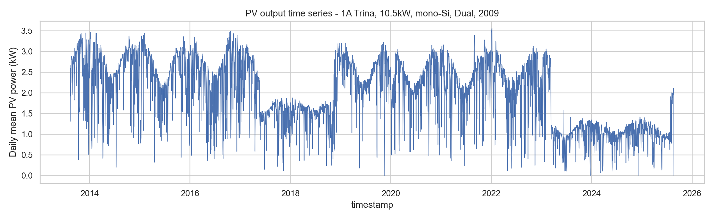

### 5.2 主要气象变量时间序列

该图展示辐照度、温度、湿度和风速等变量的长期变化。它有助于判断气象数据是否存在明显缺失、漂移或异常波动。

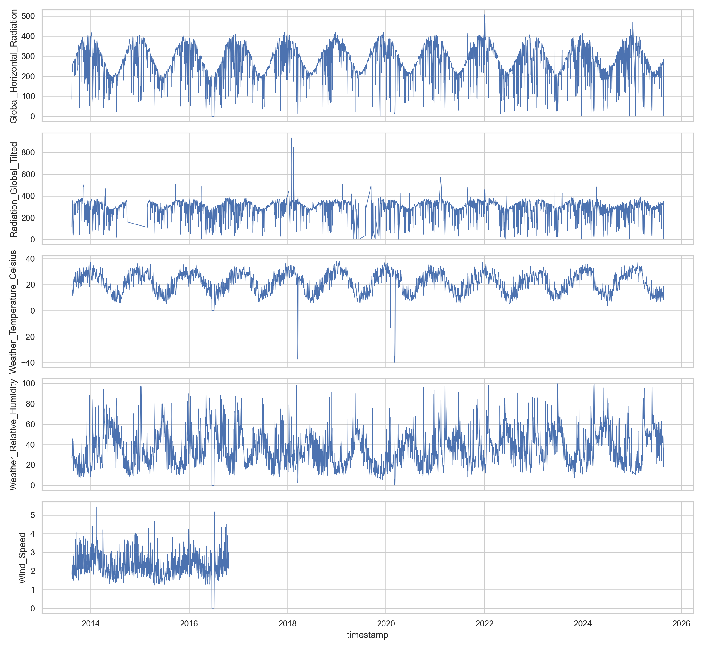

### 5.3 辐照度与 PV 输出关系

辐照度与 PV 输出呈明显正相关。尤其在 daylight 样本中，辐照度越高，光伏输出通常越高，这也与后续相关性和特征重要性结果一致。

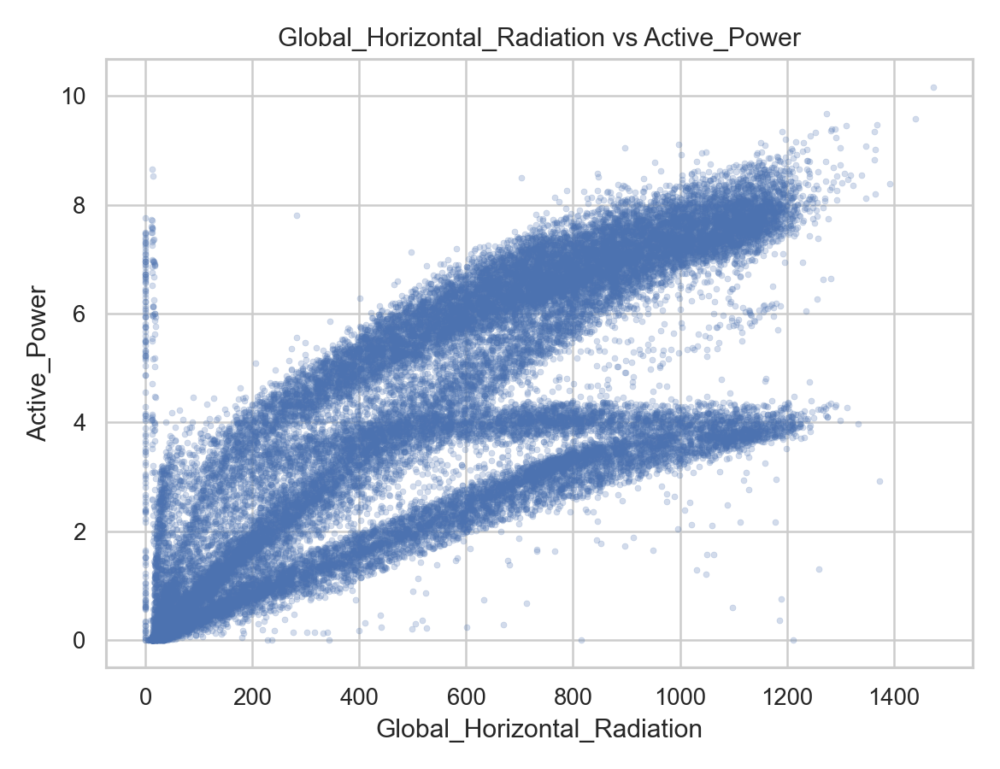

### 5.4 温度与 PV 输出关系

温度与 PV 输出之间的关系较复杂。高温可能降低组件效率，但高温也常与晴天和强辐照度同时出现，因此仅靠散点图不能直接推断温度的净影响。

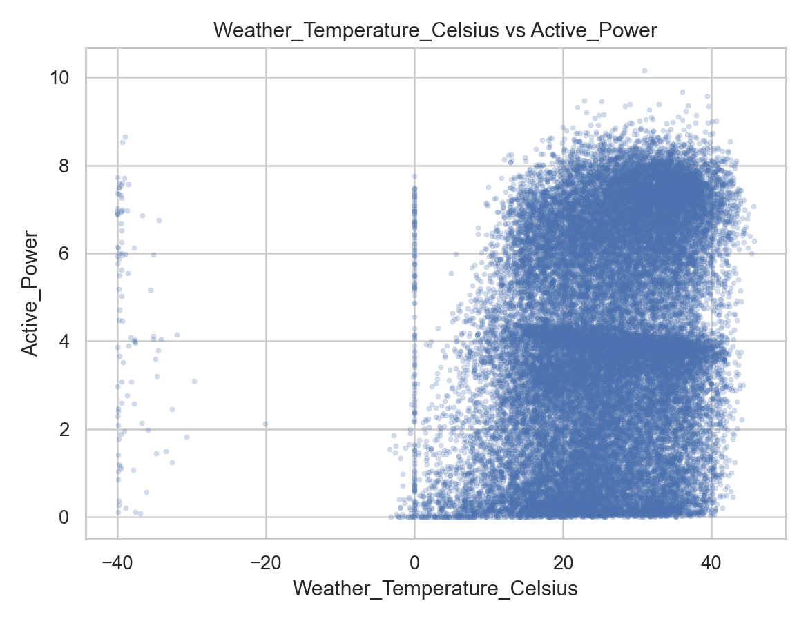

### 5.5 湿度与 PV 输出关系

湿度整体上与 PV 输出呈负相关趋势。较高湿度往往与云量、水汽和大气衰减有关，可能间接降低到达组件表面的有效辐照度。

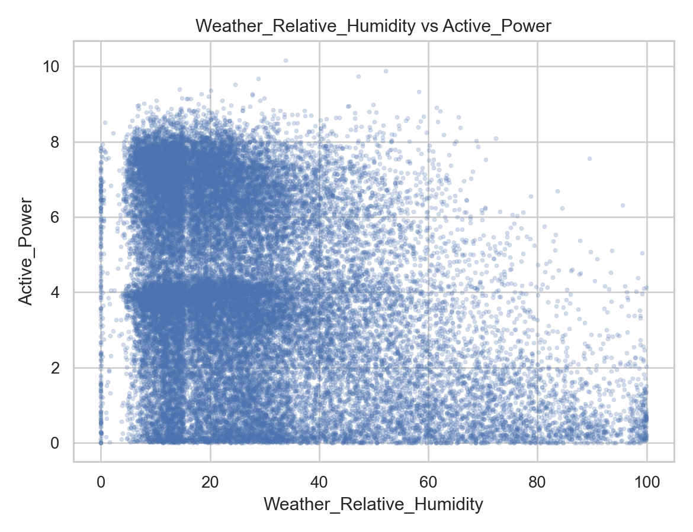

### 5.6 风速与 PV 输出关系

风速对 PV 输出的影响相对间接。适度风速可能通过组件冷却提升效率，但其作用明显弱于辐照度。

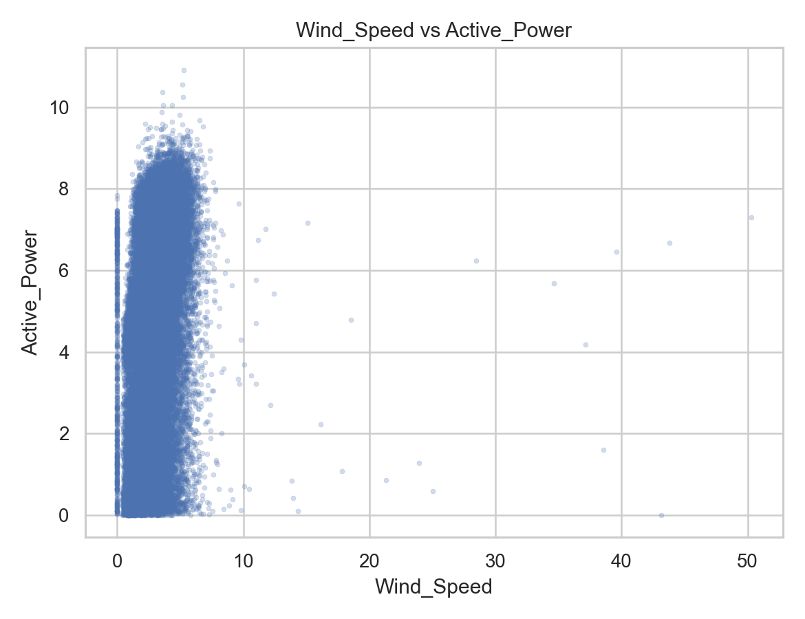

### 5.7 特征相关性热图

相关性热图展示了各气象变量、时间特征与 PV 输出之间的线性关系。结果显示，倾斜面辐照度和水平总辐照度与 PV 输出的相关性最强。

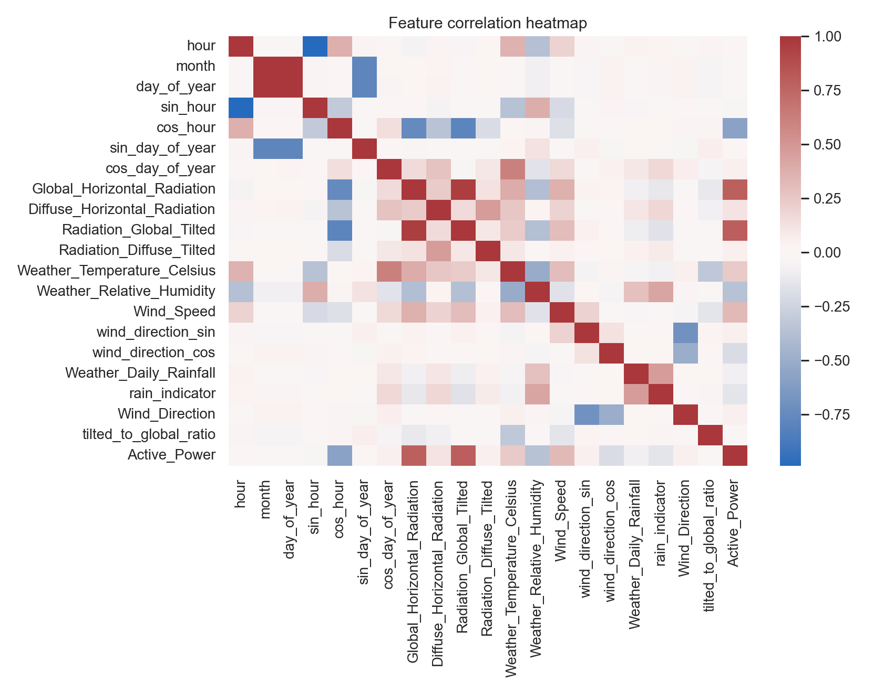

### 5.8 Random Forest 特征重要性

Random Forest 的特征重要性进一步确认，`Radiation_Global_Tilted` 是最关键的预测变量，其次是 `Global_Horizontal_Radiation`。风速、风向和季节性时间特征也提供了补充信息。

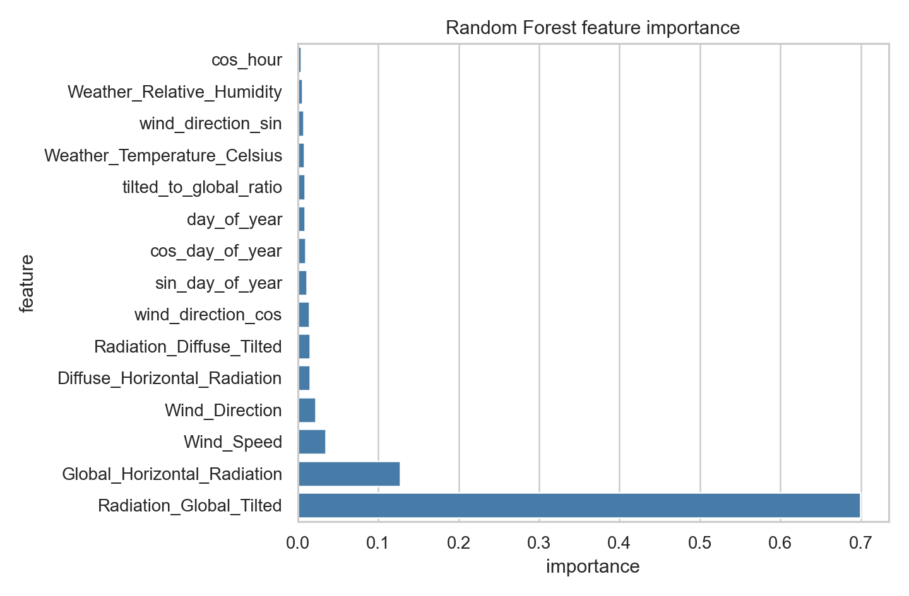

### 5.9 Permutation Importance

Permutation importance 通过打乱单个特征并观察模型误差变化来评估特征贡献。结果同样表明，辐照度变量对模型性能影响最大。

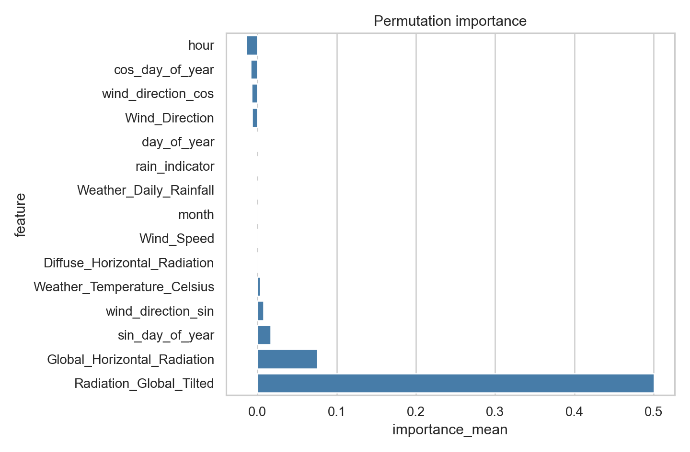

### 5.10 消融实验结果

消融实验比较了不同特征组的预测效果。结果显示，辐照度是核心特征，加入时间和风场变量后模型表现进一步改善。

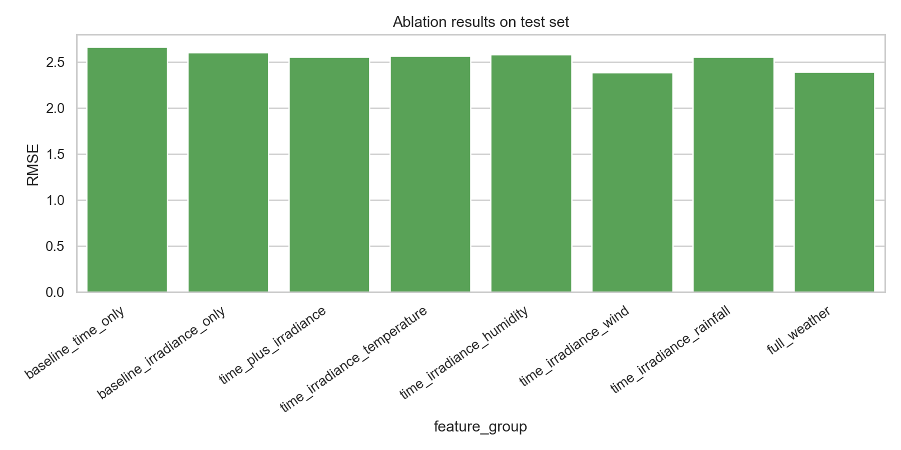

### 5.11 预测值与真实值对比

该图展示测试阶段真实 PV 输出与模型预测值的对比。可以看到模型能够捕捉部分趋势，但在后期测试集上仍存在明显误差，说明时间分布漂移需要进一步处理。

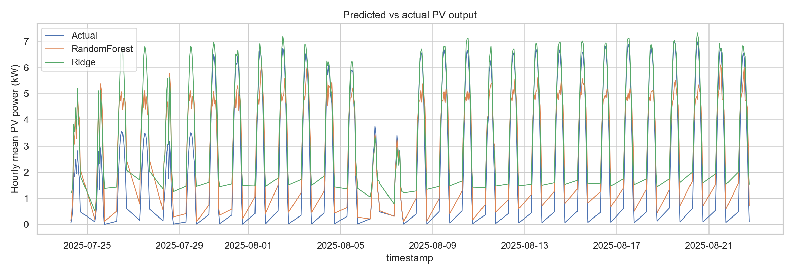

### 5.12 平均日内变化曲线

平均日内曲线展示了一天中 PV 输出和辐照度的典型变化。PV 输出随太阳辐照增强而上升，并在下午随辐照度下降而回落。

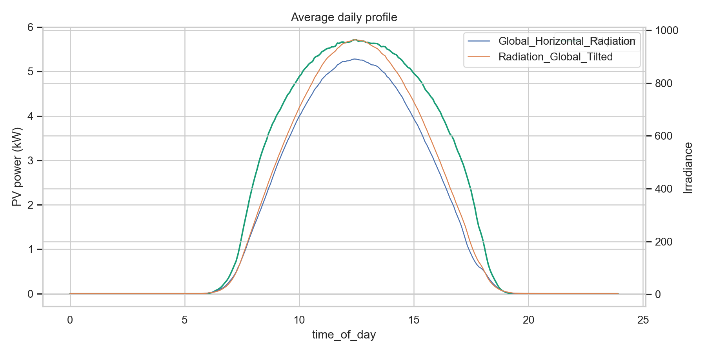

## 6. 输出文件

主要结果表保存在 `results/` 目录：

| 文件 | 内容 |
|---|---|
| `data_summary.csv` | 数据规模、时间范围和采样间隔 |
| `missing_value_summary.csv` | 缺失值统计 |
| `quality_checks_1a_trina.csv` | 主 PV 标签质量检查 |
| `feature_correlation_1a_trina.csv` | Pearson / Spearman 相关性 |
| `mutual_information_1a_trina.csv` | 互信息结果 |
| `feature_importance_1a_trina.csv` | Random Forest 特征重要性 |
| `permutation_importance_1a_trina.csv` | Permutation importance |
| `ablation_results_1a_trina.csv` | 消融实验结果 |
| `model_metrics.csv` | Ridge 与 Random Forest 模型指标 |
| `total_sites_sign_diagnostic.csv` | Total of all sites 符号诊断 |

清洗后的主分析数据保存在 `data/processed/cleaned_1a_trina.csv`。该文件体积较大，默认不建议上传到 GitHub。

## 7. 结论

本次分析表明，对于 DKASC Alice Springs 的 1A Trina 光伏系统，辐照度变量是影响 PV power 的主导因素，其中倾斜面总辐照度和水平总辐照度最关键。湿度、风速、风向、温度和降雨等变量也具有一定解释力，但更多体现为辅助影响。

从预测角度看，Random Forest 能在验证集上优于线性模型，但在时间序列测试集上表现不稳定，说明该数据集存在分布漂移或系统状态变化。后续若要构建更稳定的发电量预测模型，需要进一步做按年份/季节的验证、系统运行状态筛查，以及对 Total of all sites 标签方向进行确认。
