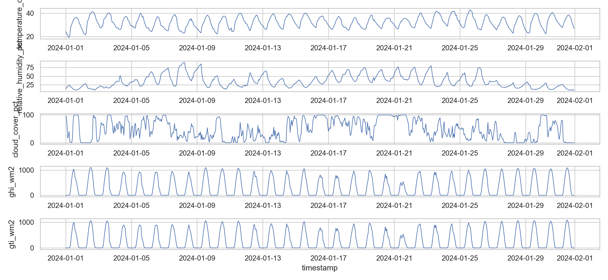
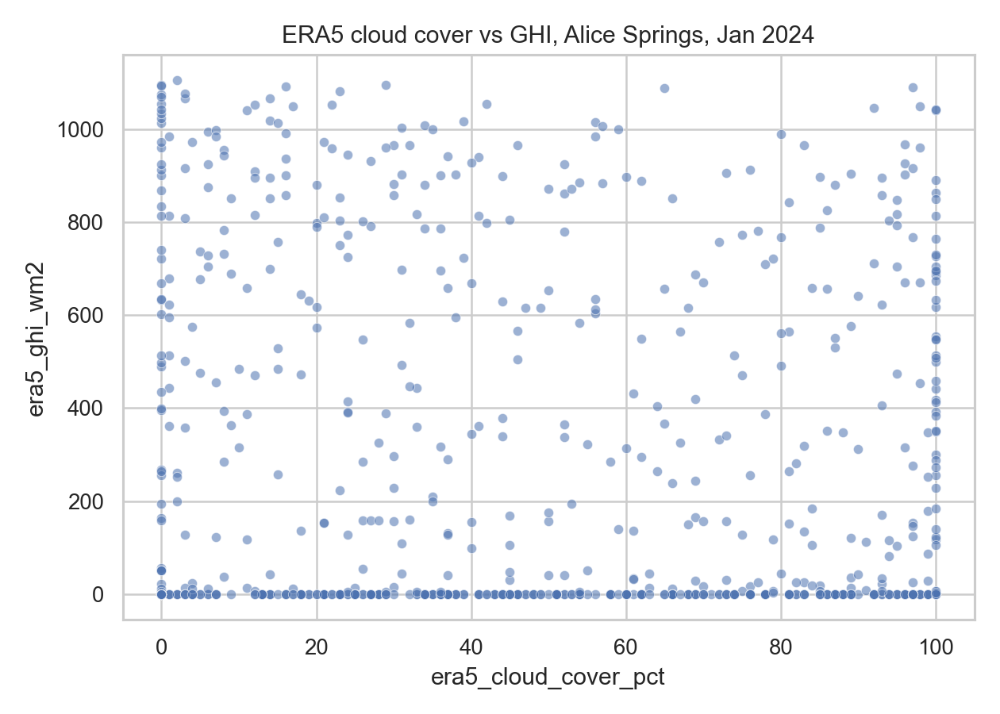
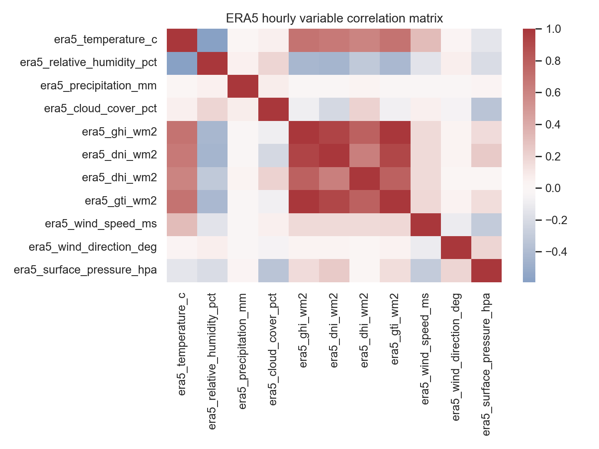
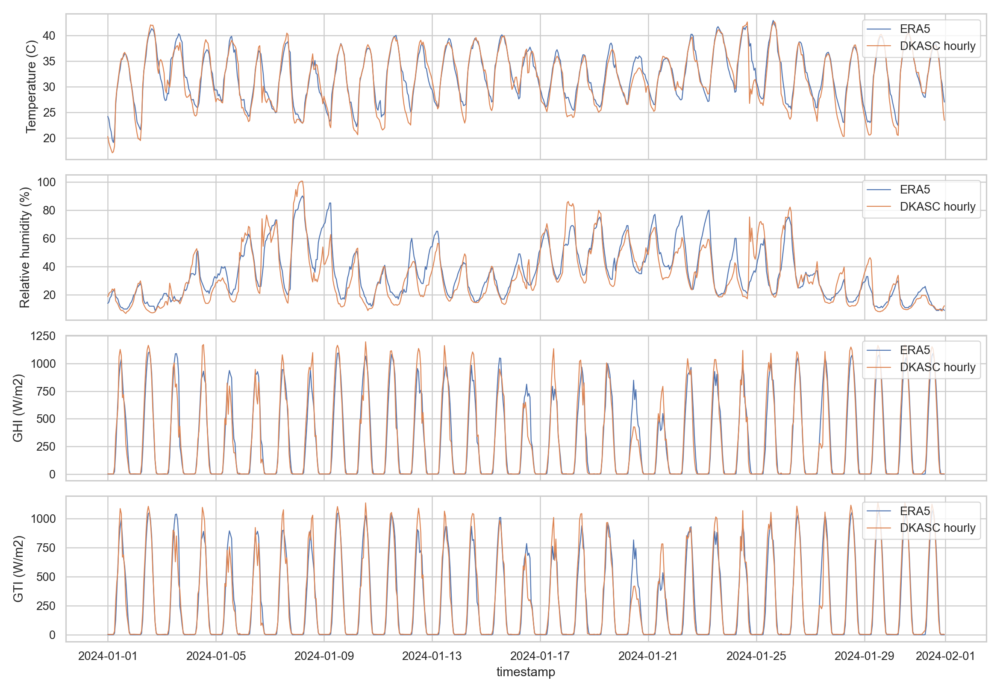
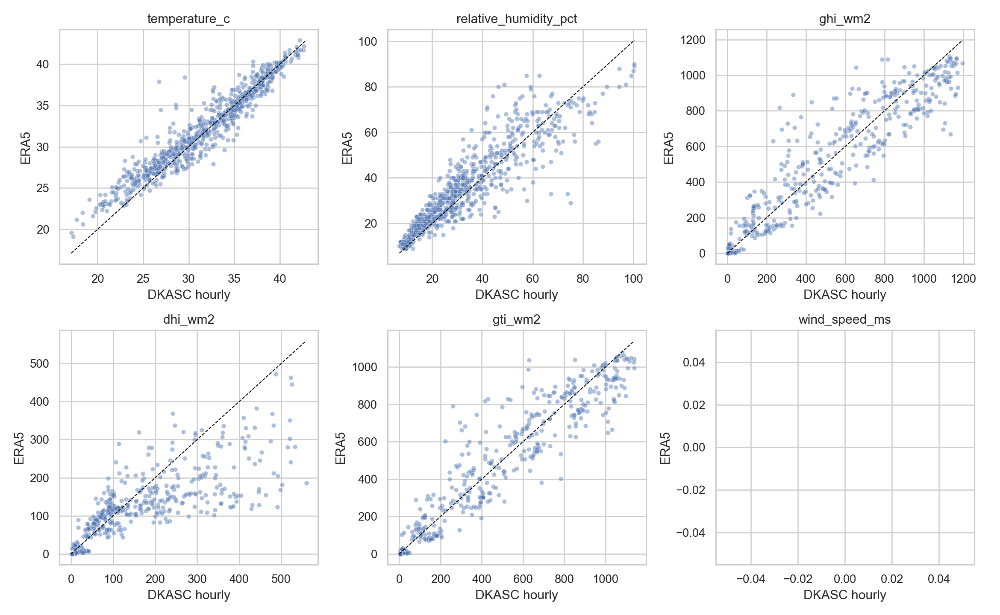

# ERA5 ?????? DKASC ????

????Open-Meteo Historical Weather API????? `models=era5`???? Alice Springs / DKASC ?????? `-23.762, 133.875`?????? `2024-01-01` ? `2024-01-31`???????? 744 ??

## ????

- temperature_2m
- relative_humidity_2m
- precipitation
- cloud_cover
- shortwave_radiation, direct_normal_irradiance, diffuse_radiation, global_tilted_irradiance
- wind_speed_10m, wind_direction_10m
- surface_pressure

## ????

ERA5 ???????? 50KB???????????? DKASC WeatherStation 2024 ? 1 ????????????? 744 ??????

## ERA5 ? DKASC ??????

| variable              |   n |   dkasc_mean |   era5_mean |   bias_era5_minus_dkasc |     MAE |     RMSE |   R2_against_dkasc |   pearson_corr |
|:----------------------|----:|-------------:|------------:|------------------------:|--------:|---------:|-------------------:|---------------:|
| temperature_c         | 742 |      31.6253 |     32.143  |                  0.5177 |  1.2368 |   1.7119 |             0.9018 |         0.9566 |
| relative_humidity_pct | 742 |      33.4432 |     35.6294 |                  2.1862 |  6.4119 |   8.7486 |             0.7985 |         0.9014 |
| ghi_wm2               | 742 |     307.839  |    304.225  |                 -3.6144 | 62.2396 | 105.769  |             0.9242 |         0.9614 |
| dhi_wm2               | 742 |     100.032  |     76.5256 |                -23.5063 | 38.9221 |  74.9719 |             0.6849 |         0.8636 |
| gti_wm2               | 742 |     288.362  |    283.263  |                 -5.0985 | 53.0786 |  92.953  |             0.9341 |         0.9666 |

## ??

## ??

ERA5 ????????????? 0.25? ??????????DKASC WeatherStation ?????????????????????????????????????????????ERA5 ????????????????/????????????????????????????? PV ?????????
