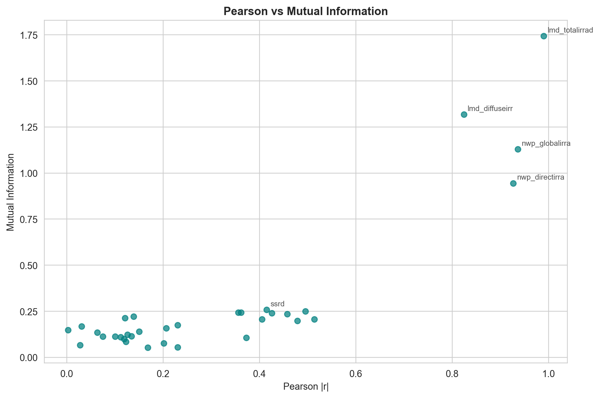
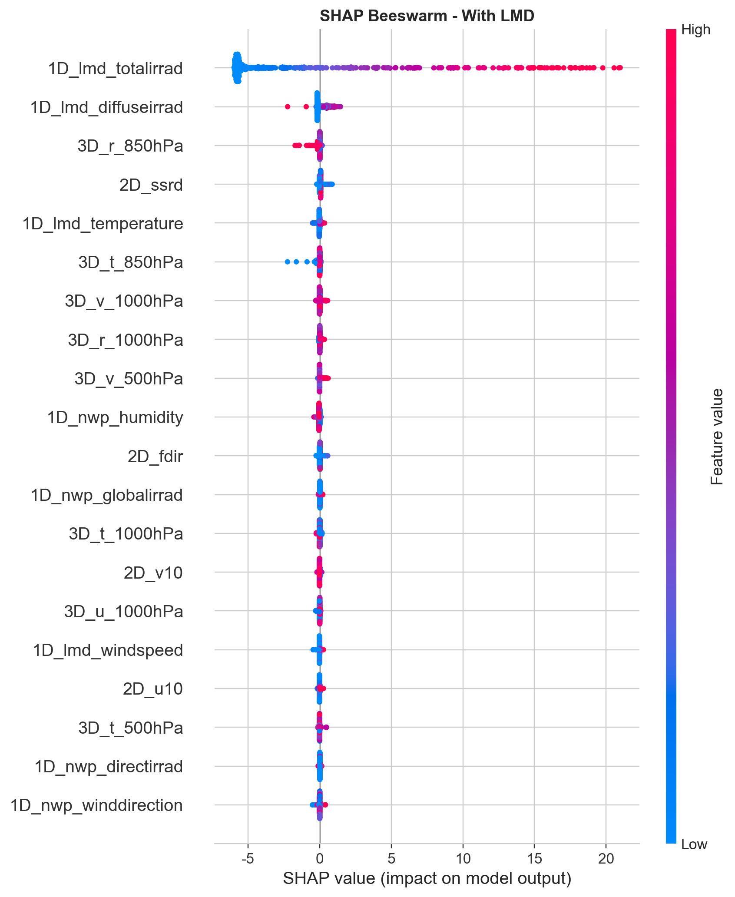
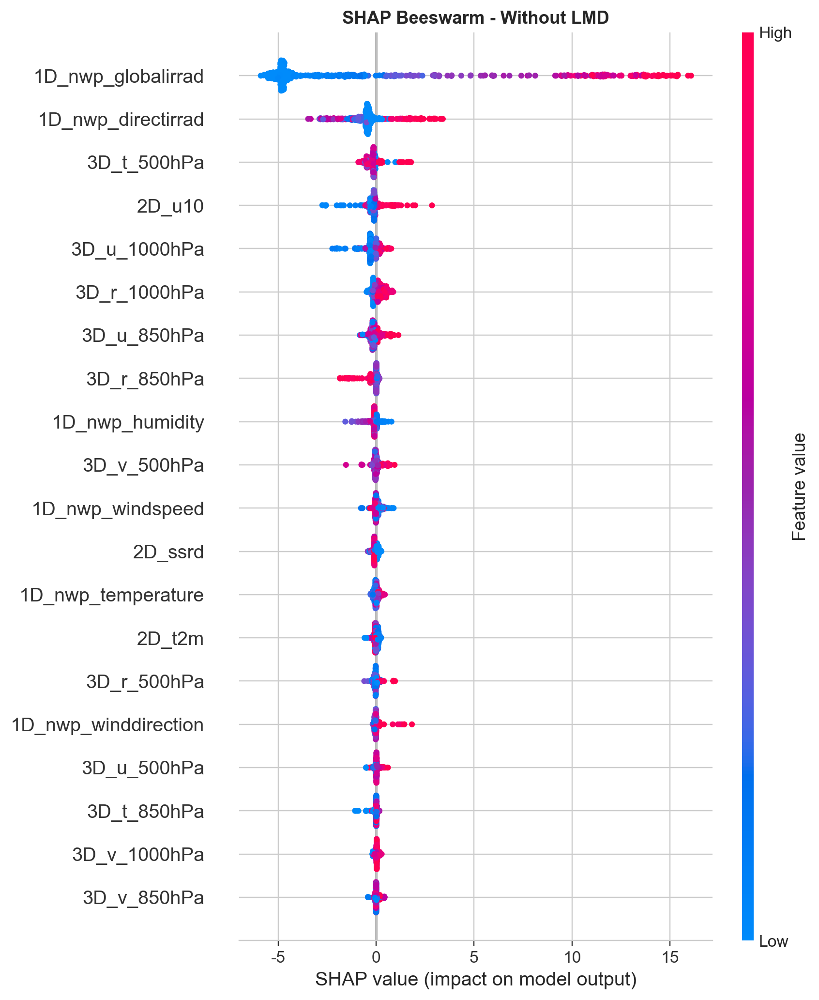

# PVOD 光伏功率特征评估与消融分析报告

Station 05 · 2019-04 · 1D/2D/3D 多源特征

## 第一部分：引言与评估体系说明

本研究面向光伏功率预测中的核心矛盾：一方面需要识别清晰的线性物理规律，另一方面必须捕捉 2D/3D 空间场中的非线性突变信号。因此采用三重过滤漏斗构建可解释且可部署的特征评估体系：

- Pearson：定位基础线性物理强关联，识别辐射等一阶驱动项。
- 互信息（MI）：评估非线性信息增益，识别线性相关不高但有信息价值的空间气象特征。
- SHAP 消融实验：对比含 LMD 与无 LMD 两种状态，刻画动态协同与特征遮蔽效应。

本次综合评分口径：Pearson(0.3) + MI(0.2) + SHAP_without_LMD(0.5)，SHAP 源为 No-LMD。

## 第二部分：单变量静态评估（Pearson 与互信息）

从 Pearson 与 MI 的联合视角可见，辐射类变量构成基础预测骨架；部分 2D/3D 空间变量虽然线性相关不高，但在 MI 上有明显增益，说明其主要通过非线性机制影响功率。

关键结论：

- 辐照相关变量稳定位居第一梯队。
- 空间风场、高空热湿状态和云量变量体现了非线性补充价值。
- 仅依赖线性模型难以充分吸收 2D/3D 信息。

## 第三部分：多变量协同与特征遮蔽消融实验（SHAP）

含 LMD 与无 LMD 的 SHAP 对比揭示了明显的特征遮蔽机制：

- 含 LMD：实测辐照特征强势主导，多数空间变量边际贡献被压缩。
- 无 LMD：NWP 与空间场变量贡献提升，2D/3D 特征的重要性更可见。

核心结论：2D/3D 网格气象数据在真实超前预测场景中具有不可替代价值。

## 第四部分：全维特征全景评估总表（The Master Table）

完整主表文件：station05_master_feature_table_2019-04.csv

下表展示按综合评分排序的前 15 个特征：

| 特征名称 | 数据源 | 特征类别 | Pearson(|r|) | 互信息(MI) | SHAP(含LMD) | SHAP(无LMD) | 综合评分 |
| --- | --- | --- | --- | --- | --- | --- | --- |
| 1D_nwp_globalirrad | 1D | 辐射类 | 0.9361 | 1.129242 | 0.032983 | 5.836404 | 0.913191 |
| 1D_lmd_totalirrad | 1D | 辐射类 | 0.9900 | 1.743786 | 6.085223 | 0.000000 | 0.500000 |
| 1D_nwp_directirrad | 1D | 辐射类 | 0.9268 | 0.945018 | 0.022488 | 0.850566 | 0.462106 |
| 1D_lmd_diffuseirrad | 1D | 辐射类 | 0.8242 | 1.317592 | 0.309059 | 0.000000 | 0.400868 |
| 3D_u_1000hPa | 3D | 风场类 | 0.4953 | 0.249369 | 0.027466 | 0.254599 | 0.200499 |
| 2D_u10 | 2D | 风场类 | 0.4578 | 0.234896 | 0.026324 | 0.295327 | 0.190964 |
| 1D_nwp_temperature | 1D | 温度类 | 0.5136 | 0.206362 | 0.014850 | 0.087491 | 0.186797 |
| 1D_lmd_temperature | 1D | 温度类 | 0.4786 | 0.198382 | 0.046553 | 0.000000 | 0.167792 |
| 2D_t2m | 2D | 温度类 | 0.4257 | 0.239920 | 0.013536 | 0.079258 | 0.163320 |
| 2D_ssrd | 2D | 辐射类 | 0.4151 | 0.258041 | 0.061170 | 0.091273 | 0.163207 |
| 1D_nwp_humidity | 1D | 湿度云量类 | 0.4053 | 0.206678 | 0.038389 | 0.163744 | 0.160537 |
| 3D_r_1000hPa | 3D | 湿度云量类 | 0.3558 | 0.243800 | 0.042611 | 0.219308 | 0.154566 |
| 2D_fdir | 2D | 辐射类 | 0.3619 | 0.243849 | 0.035609 | 0.020664 | 0.139401 |
| 1D_lmd_windspeed | 1D | 风场类 | 0.3728 | 0.106565 | 0.026895 | 0.000000 | 0.125207 |
| 1D_nwp_winddirection | 1D | 风场类 | 0.2299 | 0.175397 | 0.021250 | 0.077444 | 0.096415 |

## 第五部分：特异性特征深度剖析（The Deep Dive）

模板化结论如下：

- 模板1（被遮蔽的黄金特征）：存在静态指标较强但在含 LMD 场景中边际贡献被压缩的特征；进入无 LMD 设定后贡献释放。
- 模板2（高 MI 低 Pearson）：部分变量线性相关一般，但通过非线性路径提升预测信息量。
- 模板3（统计学假象）：部分变量可能与主辐照变量共线，相关性看似存在但边际贡献有限。

建议在后续模型迭代中，优先通过时序交叉验证对这些模板特征做逐类验证，而不是只看单一指标。

## 第六部分：低效特征剔除声明与下一步工程计划

低效特征剔除声明：

- 三低特征数量为 2（Pearson、MI、SHAP_without_LMD 均处于低分位）。
- 这类特征继续保留会增加维度负担和过拟合风险。

下一步工程计划：

- 基于主表高价值特征构建高阶交互项（辐照度 × 温度、辐照度 × 云量）。
- 在时序交叉验证框架中评估泛化性能和误差稳定性。
- 按场景（低/中/高辐照）做误差分层监控。

## 附录：样本与场景误差

样本摘要：

- 原始样本数：2848
- 清洗后样本数：2813
- 删除率：1.23%
- Top1 特征：1D_nwp_globalirrad（Composite=0.9132）

分场景误差（来自 station05_enhanced_scene_metrics.csv）：

| 场景 | 样本数 | MAE | RMSE | MAPE(%) |
| --- | ---: | ---: | ---: | ---: |
| Low Irradiance | 209 | 0.0324 | 0.0424 |  |
| Medium Irradiance | 99 | 0.2654 | 0.3900 |  |
| High Irradiance | 159 | 1.9819 | 2.6240 | 25.0622 |

---

相关产物文件：

- station05_master_feature_table_2019-04.csv
- station05_feature_metadata_2019-04.csv
- station05_cleaned_2019-04.csv
- station05_engineered_2019-04.csv
- station05_pearson_vs_mi_scatter.png
- station05_shap_beeswarm_full.png
- station05_shap_beeswarm_no_lmd.png
- station05_analysis_summary_2019-04.txt
