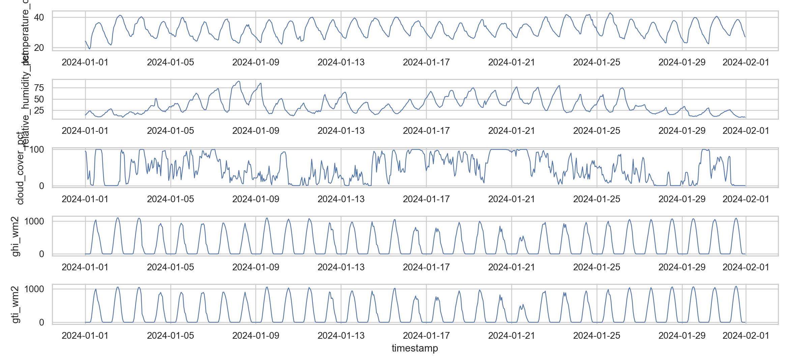
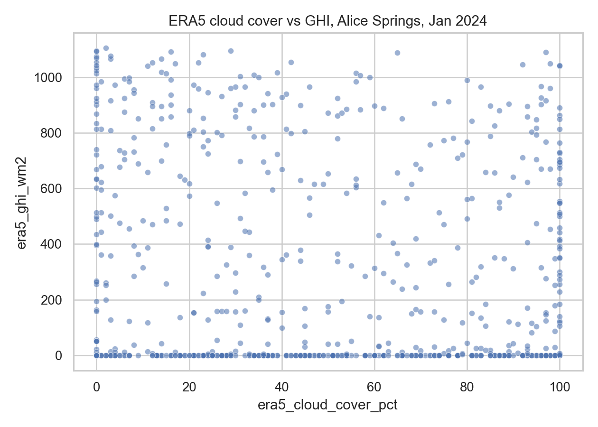
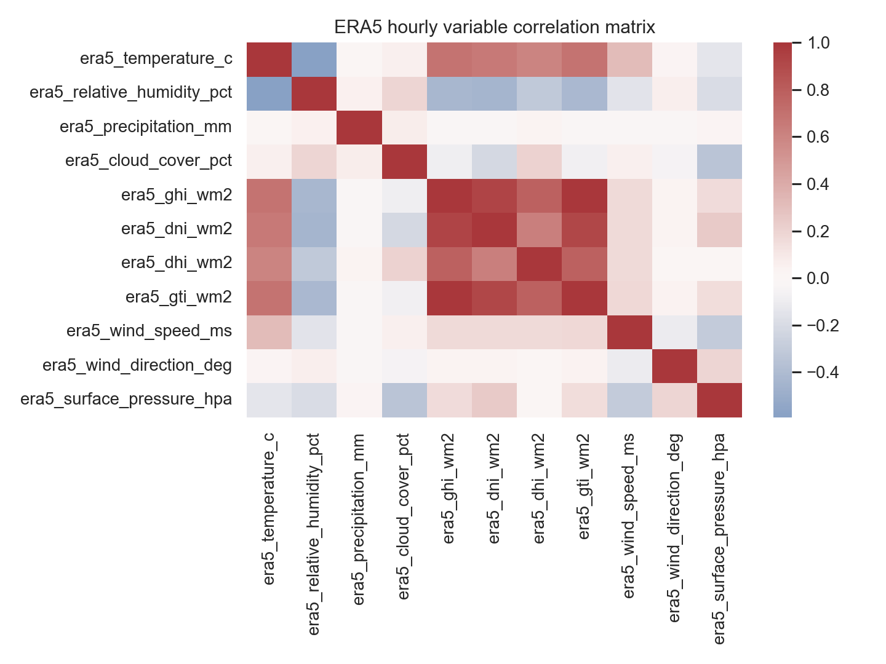
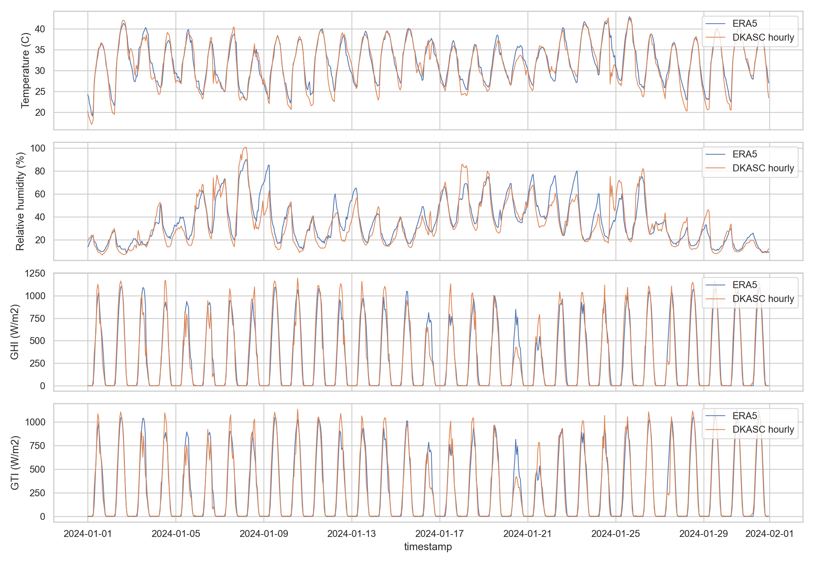
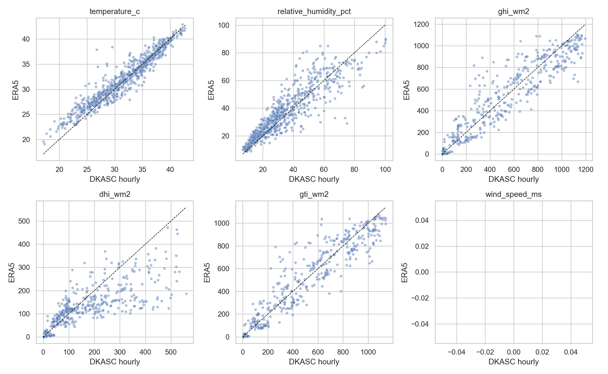

# ERA5 与 DKASC 初步天气一致性分析

历史样本：Alice Springs，坐标 −23.762, 133.875，2024-01-01至2024-01-31，共744小时。数据经 Open-Meteo Historical Weather API 获取，参数为 `models=era5`，不是直接从 CDS 下载的原始文件。

## 数据与配对

天气字段含温度、湿度、降雨、云量、辐射、风速/风向和地表气压。与 DKASC WeatherStation 同期小时数据对齐后，各表列变量为742个有效配对。以下数值保留自已有结果，本次仅整理报告，没有重新获取或重算该历史天气实验。

## 已保存指标

| variable              |   n |   dkasc_mean |   era5_mean |   bias_era5_minus_dkasc |     MAE |     RMSE |   R2_against_dkasc |   pearson_corr |
|:----------------------|----:|-------------:|------------:|------------------------:|--------:|---------:|-------------------:|---------------:|
| temperature_c         | 742 |      31.6253 |     32.143  |                  0.5177 |  1.2368 |   1.7119 |             0.9018 |         0.9566 |
| relative_humidity_pct | 742 |      33.4432 |     35.6294 |                  2.1862 |  6.4119 |   8.7486 |             0.7985 |         0.9014 |
| ghi_wm2               | 742 |     307.839  |    304.225  |                 -3.6144 | 62.2396 | 105.769  |             0.9242 |         0.9614 |
| dhi_wm2               | 742 |     100.032  |     76.5256 |                -23.5063 | 38.9221 |  74.9719 |             0.6849 |         0.8636 |
| gti_wm2               | 742 |     288.362  |    283.263  |                 -5.0985 | 53.0786 |  92.953  |             0.9341 |         0.9666 |

## 图表

## 适用范围

这是历史天气一致性分析，不是增加 ERA5 后未来光伏预测增益的实验。高相关不等于站点测量与再分析完全等价。API配置、时间和辐射口径仍需结合后续正式实验说明；预测效果以 station05 系列报告为准。数据和已保存指标在 `../ERA5_Analyze/` 中。
