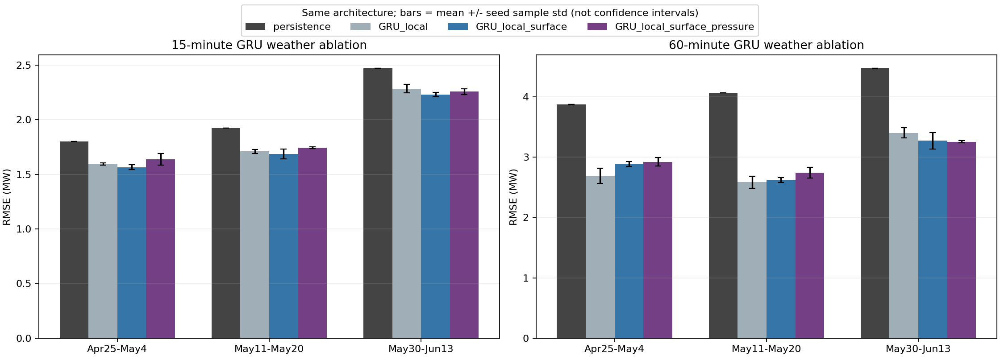

# station05 第三轮：同一 GRU 网络的天气消融

日期：2026-10-05。状态：实验、模型保存、数值复核和图表检查均完成。

## 实验问题与控制条件

本轮只回答：在同一 GRU 架构和训练协议下，加入 ERA5 地表及气压层，是否改善未来 15 分钟和 1 小时功率预测？

三种输入组均包含历史功率与可预先计算的目标时间周期特征：

| 输入组 | 启用的序列字段 | 活跃字段数 |
|---|---|---:|
| local | 功率 + 站点 LMD 天气 | 8 |
| local_surface | local + ERA5 地表（u10/v10/d2m/t2m/sp/tcc/ssrd/fdir） | 16 |
| local_surface_pressure | 再加 r/t/u/v 的 500/850/1000 hPa 特征 | 28 |

使用第二轮单层 GRU hidden=32、Dense32/ReLU/Dense1，预测相对持续性基线的残差。16 步输入、两个预测提前量、三个时间前推区间、种子 17/42/2026，共 **54 次独立训练**。

为固定网络形状和初始化，所有组保留 28 个输入槽；未启用变量在 scaler 拟合前置零。每组网络均有 7,169 个参数，同种子初始权重相同。未启用槽的 mean=0、scale=1，传给网络的是零，不含被排除的天气信息。各组重新训练，而不是对全特征模型临时删输入。

优化器、批次顺序、35 epoch 上限、验证选最佳 epoch 和连续 7 epoch 无改善停止规则相同；各组最佳 epoch 可以不同。输入与残差 scaler 只拟合训练数据。样本在完整天气窗口上统一筛选，三个输入组的训练、验证和评价样本完全一致。

沿用第二轮切分：roll_1 评价 4 月 25 日至 5 月 4 日；roll_2 评价 5 月 11–20 日；roll_3 评价 5 月 30 日至 6 月 13 日。UTC 5 月 31 日从全部数据源排除，任何窗口或起点至目标间隔跨缺口均删除。训练标签早于首个验证起点，验证标签早于首个评价起点。全部指标单位 MW。

## 全天 RMSE

数值是三个随机种子的均值 ± 样本标准差，不是置信区间，也不是对三次预测求平均后的集成指标。持续性为确定性基线。

| Horizon (min) | Fold | N | Persistence | Local GRU | + ERA5 surface | + pressure levels |
|---|---|---:|---:|---:|---:|---:|
| 15 | roll_1 | 959 | 1.7991 | 1.5948 +/- 0.0104 | 1.5648 +/- 0.0233 | 1.6371 +/- 0.0531 |
| 15 | roll_2 | 959 | 1.9222 | 1.7089 +/- 0.0175 | 1.6871 +/- 0.0445 | 1.7442 +/- 0.0083 |
| 15 | roll_3 | 1295 | 2.4687 | 2.2836 +/- 0.0397 | 2.2313 +/- 0.0192 | 2.2571 +/- 0.0257 |
| 60 | roll_1 | 956 | 3.8738 | 2.6887 +/- 0.1244 | 2.8845 +/- 0.0418 | 2.9227 +/- 0.0680 |
| 60 | roll_2 | 956 | 4.0632 | 2.5845 +/- 0.1022 | 2.6216 +/- 0.0406 | 2.7442 +/- 0.0886 |
| 60 | roll_3 | 1289 | 4.4704 | 3.4029 +/- 0.0853 | 3.2736 +/- 0.1379 | 3.2550 +/- 0.0192 |

| Horizon (min) | Fold | Surface improvement (%) | Pressure improvement (%) |
|---|---|---:|---:|
| 15 | roll_1 | +1.88 | -4.62 |
| 15 | roll_2 | +1.28 | -3.38 |
| 15 | roll_3 | +2.29 | -1.15 |
| 60 | roll_1 | -7.28 | -1.32 |
| 60 | roll_2 | -1.44 | -4.68 |
| 60 | roll_3 | +3.80 | +0.57 |

改善百分比依据各组种子均值的 RMSE 计算，正值为改善；地表相对 local，气压层相对地表。

## 结果解读

1. **15 分钟：ERA5 地表有小幅且跨区间一致的平均收益。** 三个区间 RMSE 降低约 1.88%、1.28%、2.29%。同种子配对的九次比较中有七次改善；因此不能说每次训练都改善。加入气压层后，三个区间均值全部变差，九次配对也全部变差。
2. **1 小时：ERA5 地表对当前 GRU 没有稳定收益。** 前两个区间均值分别变差约 7.28%、1.44%，最后一个区间改善约 3.80%；九次同种子比较仅三次改善。气压层同样只有最后一个区间的全天均值略改善，九次配对三次改善。
3. **不能把树模型的结论直接推广到 GRU。** 第二轮树模型加地表在三个 1 小时区间都改善，而本轮 GRU 的前两个区间反而变差。天气特征是否被有效利用与模型、训练预算和时段有关。
4. 所有输入组的三种子全天平均 RMSE 都优于持续性。这个结果支持 GRU 基线有效，但并不说明 ERA5 或气压层始终必要。
5. 更多变量可能增加拟合难度、冗余或过拟合，但本实验没有区分这些机制，不将其作为已证实原因。也不能由单一模型的负结果认定气压层没有预测信息。

## 白天评价补充

白天按目标实测辐照 >20 W/m² 定义，只在评价时使用。15 分钟加地表后，白天 RMSE 在三个区间也都降低；再加气压层均变差。

1 小时最后区间，白天 RMSE 为 local 4.5146 MW、加地表 4.3597 MW、加气压层 4.3720 MW。即使最后区间的全天指标显示气压层略有改善，白天指标仍略变差；不能仅选有利口径报告收益。完整 MAE/RMSE/R² 与全天/白天样本数见 metrics.csv。

## 证据与复现

- [训练脚本](../PVOD_Forecast/experiments/run_weather_ablation_v3.py)、[协议及复现说明](../PVOD_Forecast/experiments/README_weather_ablation_v3.md)。依赖沿用 requirements_sequence.txt。
- [配置与启用字段](../PVOD_Forecast/results/station05_weather_ablation_v3/config.json)、[输入和代码哈希](../PVOD_Forecast/results/station05_weather_ablation_v3/manifest.json)。
- [全部指标](../PVOD_Forecast/results/station05_weather_ablation_v3/metrics.csv)、[种子汇总](../PVOD_Forecast/results/station05_weather_ablation_v3/seed_summary.csv)、[同种子配对差异](../PVOD_Forecast/results/station05_weather_ablation_v3/paired_deltas.csv)、[每日误差](../PVOD_Forecast/results/station05_weather_ablation_v3/daily_metrics.csv)。
- 六份区间/提前量预测 CSV、54 份网络权重及 scaler、训练日志和曲线数据、最佳 epoch、切分均在结果目录。
- [独立复核脚本](../PVOD_Forecast/experiments/validate_weather_ablation_v3.py)已实际运行：重算 120 行评价指标，确认样本与切分、缺口处理和全部预测有限；重新加载全部 54 个模型，每个从对齐表重建三个序列样本验证推理；确认所有组参数数量相同，被排除输入确实为零。
- 完整天气组的 18 次训练在全部评价点精确复现第二轮 GRU（最大绝对差为零），说明新增消融没有改变完整组的基准。
- [复核结果](../PVOD_Forecast/results/station05_weather_ablation_v3/validation_checks.json)已保存，运行日志无 Warning / Traceback，最终图已实际打开检查。未改写第一轮或第二轮模型与结果。

## 当前结论与交付用途

本轮已完成“同一网络的天气消融”，可作为 ERA5 技术说明和 Final Report 的神经网络特征增益证据。应同时保留树模型和 GRU 的正、负结果：ERA5 地表是有价值的候选特征，气压层尚无稳定增益；当前 GRU 的 15 分钟任务较适合地表输入，1 小时需要谨慎选择。

暂不为追求正结果继续围绕这些评价区间调参。后续应先完成天气对齐一致性检查和场景误差分析，必要时再用独立数据验证特征选择。

所有时间区间均已在以前实验查看过，本轮是固定协议的探索性消融，不是新增独立 holdout。ERA5 仍是事后再分析 valid-time 输入，发布延迟未模拟；结论只覆盖这个站点、时间段、架构和训练预算，不能据此承诺实时部署效果或全年泛化。
