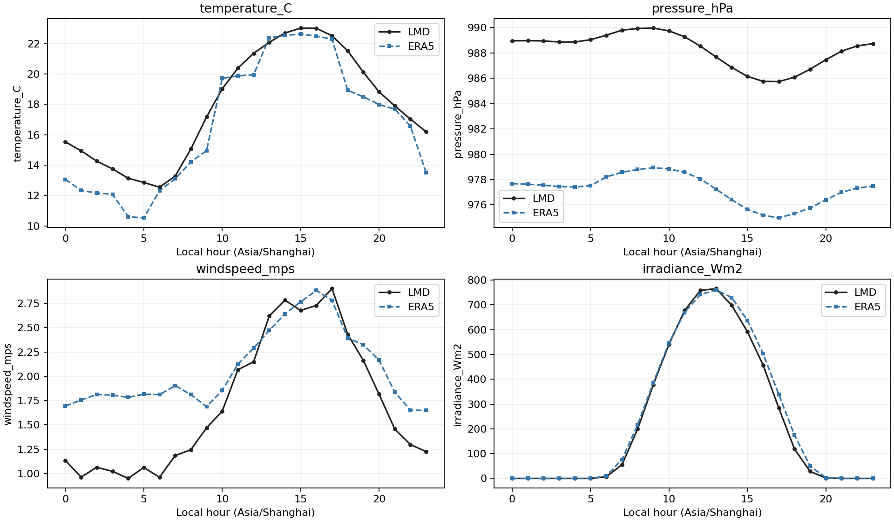
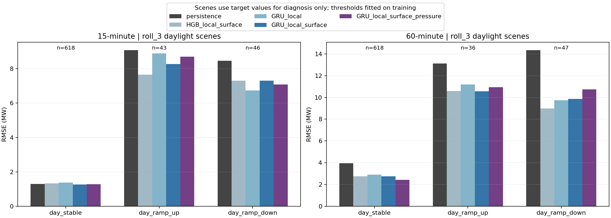

# station05 第四轮：ERA5 天气一致性与场景误差诊断

日期：2026-10-05。状态：已完成数据计算、保存指标、复核场景分组和图表检查。本轮复用既有模型预测，没有重新训练、修改参数或调整原始时间标签。

## 天气对齐检查方法

使用 ERA5 原生小时 valid time 与同一 UTC 小时的站点测量配对，避免把小时天气向后保持后的四个 15 分钟样本当作独立天气观测。温度为 °C，气压为 hPa，风速为 m/s。ERA5 风速取 sqrt(u10²+v10²)。展示日周期时才转换 Asia/Shanghai。

ERA5 ssrd 已从每小时能量除以 3600 转为前一小时平均 W/m²。站点辐照用 t-1h、t-45min、t-30min、t-15min、t 五个样本作梯形积分，再除以一小时；另保存右端四点平均作敏感性检查。这里假设 LMD 标签是瞬时测量，原始数据对测量积分区间的语义尚不完全明确，因此是近似的区间比较，不是精确的传感器标定。

排除 UTC 5 月 31 日，不对缺口插值；小时积分跨缺口或边界缺测时不配对。全量变量配对覆盖 station05 的 2019 年 3–6 月可用数据。这是描述性审计；没有根据相关性重新选择时区或移动时间标签。

## 天气一致性结果

偏差定义为 ERA5 − LMD；MAE/RMSE 使用各行变量的原单位。

| 变量 | 范围 | 配对数 | Pearson 相关 | 平均偏差 | MAE | RMSE |
|---|---|---:|---:|---:|---:|---:|
| 温度 °C | 全部 | 2400 | 0.9732 | -1.1584 | 1.7030 | 2.1984 |
| 气压 hPa | 全部 | 2400 | 0.9947 | -11.0095 | 11.0095 | 11.0403 |
| 风速 m/s | 全部 | 2400 | 0.4882 | +0.3625 | 1.1197 | 1.4451 |
| 辐照 W/m²，梯形积分 | 全部 | 2398 | 0.9630 | +11.7035 | 45.0391 | 85.8688 |
| 辐照 W/m²，梯形积分 | 站点小时均值 >20 | 1233 | 0.9260 | +21.4973 | 86.2267 | 119.3044 |
| 辐照 W/m²，右端四点均值 | 全部 | 2398 | 0.9597 | +11.7120 | 47.7701 | 89.6662 |

温度和辐照的日周期较一致，当前配对未显示此前八小时错位那样明显的现象；相关性高不等于没有误差或等价测量。气压变化趋势高度相关，但存在约 -11 hPa 的系统偏差。站点/网格地形高度、压力定义或测量口径差异只是待核实的候选解释，没有证据确认具体原因。

风速一致性较弱；站点传感器高度与局地环境资料不完整，不将 ERA5 10 米网格风速当作站点风速的等价替代。未校正气压或其他偏差。若后续做偏差校正，必须仅在训练期拟合并在验证/评价期检查，不能使用本次全期均值直接校正模型输入。

## 场景定义：阈值只使用训练数据

沿用三个区间和 15/60 分钟任务。每个区间、提前量分别从训练标签拟合：

- 夜间/低光：目标实测辐照 <=20 W/m²；这个类别也包含部分晨昏，不严格等于天文夜间。
- 白天低/中/高辐照：在训练白天样本上取辐照的 1/3、2/3 分位数，再用于评价分组。
- 白天快速升/降：目标功率相对预测起点的净变化，绝对值超过训练白天净变化的第 90 百分位；其余白天样本标记为非突变（day_stable）。该定义不识别区间内先升后降、净变化抵消的所有快速波动。

场景归类使用未来实际值，只用于事后误差解释，不参与模型输入或实时模型路由。阈值定义、训练样本数和最后训练时间均保存。最新 roll_3 的辐照分界是 243 / 652 W/m²；15 分钟突变阈值为 3.2492 MW，1 小时为 8.2376 MW。

合并第二轮 LSTM/树模型和第三轮 GRU 消融的同一评价点，验证完整 GRU 两轮结果相同。每份场景表含 16 个模型/种子预测列，全天/白天汇总仍可回溯原结果。

## 最新区间的突变场景结果

RMSE 单位 MW；GRU 数值为三个种子的平均 RMSE，不是集成预测。快速升降样本较少，不能由细小差异认定显著优劣。

| Horizon (min) | Scene | N | Persistence | HGB + surface | GRU local | GRU + surface | GRU + pressure |
|---|---|---:|---:|---:|---:|---:|---:|
| 15 | day_stable | 618 | 1.3019 | 1.3248 | 1.3787 | 1.2638 | 1.2772 |
| 15 | day_ramp_up | 43 | 9.0841 | 7.6579 | 8.8883 | 8.2772 | 8.6959 |
| 15 | day_ramp_down | 46 | 8.4587 | 7.3134 | 6.7293 | 7.3116 | 7.0852 |
| 15 | night_lowlight | 588 | 0.0905 | 0.0654 | 0.3443 | 0.2767 | 0.1862 |
| 60 | day_stable | 618 | 3.9467 | 2.7525 | 2.9080 | 2.7438 | 2.4256 |
| 60 | day_ramp_up | 36 | 13.1295 | 10.6001 | 11.2016 | 10.5628 | 10.9510 |
| 60 | day_ramp_down | 47 | 14.3510 | 8.9818 | 9.7298 | 9.8729 | 10.7341 |
| 60 | night_lowlight | 588 | 0.6500 | 0.2183 | 0.9285 | 0.8062 | 0.6430 |

## 主要发现

1. 快速升降样本的误差远高于非突变样本。最新区间 1 小时地表树模型：非突变 RMSE=2.7525 MW；快速升=10.6001 MW，快速降=8.9818 MW。它优于对应持续性基线，但仍不能准确追踪所有大幅变化。
2. ERA5 不会消除快速变化误差。最新区间 15 分钟 GRU 地表组在快速升样本上优于 local（8.2772 vs 8.8883 MW），快速降则更差（7.3116 vs 6.7293 MW），说明整体平均收益掩盖了场景差异。
3. 最新区间 1 小时气压层 GRU 在非突变样本中较好（2.4256 MW），但快速升降都比地表组差。全天平均略改善不能解释为突变预测能力提升。
4. 夜间/低光误差相对较小，但 GRU 仍会产生正功率误差，树模型较低。不能用未来实测辐照给预测事后清零再宣称提升；如增加夜间约束，应使用预测时可计算的太阳位置或可用输入，另设实验验证。
5. 当前结果支持以地表树模型作为稳健对照，同时保留 GRU 的天气消融正负结果。没有单一模型在所有场景都最好。

## 可复现产物与验证

- [诊断脚本](../PVOD_Forecast/experiments/run_diagnostics_v4.py)、[运行说明](../PVOD_Forecast/experiments/README_diagnostics_v4.md)。
- [天气小时配对](../PVOD_Forecast/results/station05_diagnostics_v4/weather_hourly_pairs.csv)、[天气一致性指标](../PVOD_Forecast/results/station05_diagnostics_v4/weather_agreement.csv)、[日周期](../PVOD_Forecast/results/station05_diagnostics_v4/weather_local_hour_cycle.csv)。
- [训练阈值](../PVOD_Forecast/results/station05_diagnostics_v4/training_scene_thresholds.csv)、[逐模型/种子场景指标](../PVOD_Forecast/results/station05_diagnostics_v4/scene_metrics.csv)、[跨种子汇总](../PVOD_Forecast/results/station05_diagnostics_v4/scene_seed_summary.csv)、[分组计数](../PVOD_Forecast/results/station05_diagnostics_v4/scene_counts.json)。
- 六份带场景标签的逐点预测 CSV、方法定义、输入文件哈希和日志位于结果目录。此前模型和结果没有被覆盖。
- 脚本独立读取保存的场景预测重算 MAE/RMSE，核对所有场景计数等于原样本数、两轮 GRU 完整组预测一致及所有预测有限。[验证记录](../PVOD_Forecast/results/station05_diagnostics_v4/validation_checks.json)已保存，运行日志无异常；两张图已实际打开检查。

本轮是对已查看历史数据的描述性审计，不是新增独立泛化验证。ERA5 的事后再分析限制仍然存在；天气相关性与预测增益是不同证据，不能互相替代。

## 后续交付

天气一致性、网络消融、树模型消融及场景诊断的实验材料已经形成。下一步应汇总正式 ERA5 技术说明、独立处理入口、结果索引和示例推理，再决定是否增加独立站点或时间段。气压口径/高度、LMD 辐照标签区间、真实天气发布时刻仍是需在技术说明中明确的限制，不应凭现有相关性宣称已解决。
