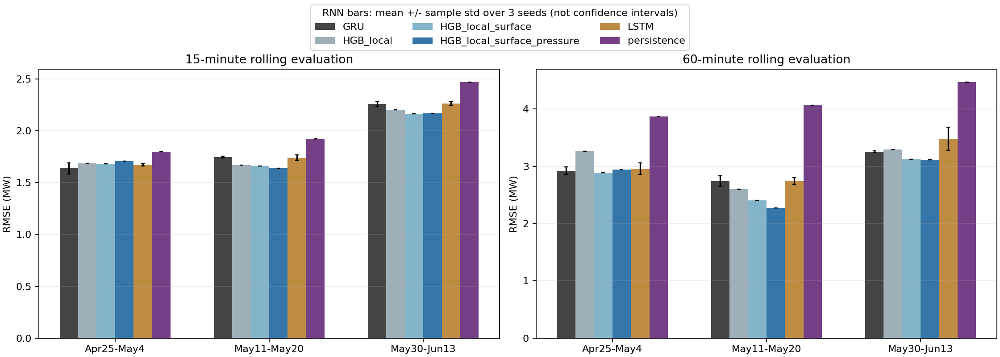
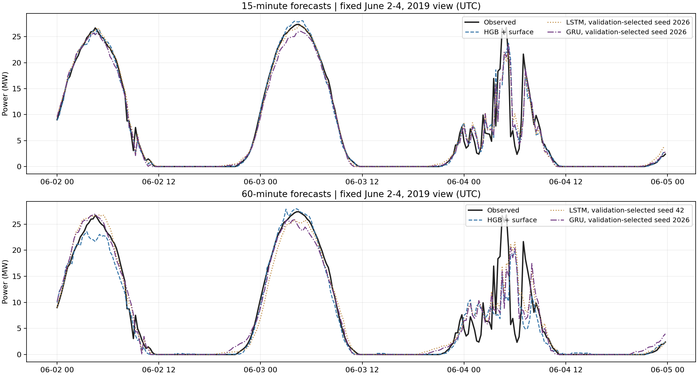

# station05 第二轮：LSTM / GRU 与滚动验证

日期：2026-10-05。状态：已运行并归档。完成 2 个预测提前量 × 3 个时间区间 × 2 类网络 × 3 个随机种子，共 **36 次神经网络训练**；并在各区间、相同样本上重跑持续性与三组树模型对照。

## 任务和本轮变化

沿用 station05 原始数据及 ERA5 对齐表，UTC、MW、排除 UTC 2019-05-31，连续历史窗口不跨缺口。读取输入前验证原始文件 SHA256 与首轮 manifest 一致。

本轮网络使用 16 步序列，每步 28 个字段（功率、LMD、ERA5 地表及气压层，风向转 sin/cos）。网络是单层 LSTM / GRU，hidden=32，加 Dense32/ReLU/Dense1；预测相对起点功率的残差，并非原 Notebook 的双层 Keras LSTM直接功率模型。目标时间周期特征单独输入。接口依据官方 [LSTM](https://docs.pytorch.org/docs/stable/generated/torch.nn.LSTM.html) / [GRU](https://docs.pytorch.org/docs/stable/generated/torch.nn.GRU.html) 文档。

种子为 17、42、2026；Adam，lr=0.001，batch=256，weight_decay=0.0001，梯度裁剪 1，最多 35 epoch，连续 7 epoch 验证无改善停止。每次均恢复验证 RMSE 最优权重，最佳 epoch 范围为 6–32。scaler 只拟合训练窗口，窗口重叠的观测按出现次数加权。

这里同时比较算法和输入表示：树模型天气只取预测起点；网络使用天气历史序列。因此不能把差异单独归因于 LSTM/GRU 架构或残差设计。

## 时间前推切分

| 区间 | 训练标签截止前 | 验证起点 | 验证标签截止前 / 评价起点 | 评价标签截止前 |
|---|---|---|---|---|
| roll_1 | 2019-04-15 | 2019-04-15 | 2019-04-25 | 2019-05-05 |
| roll_2 | 2019-05-01 | 2019-05-01 | 2019-05-11 | 2019-05-21 |
| roll_3 | 2019-05-15 | 2019-05-15 | 2019-05-30 | 2019-06-14 |

全部 UTC，末段实际数据只到 6 月 13 日 15:45。后续区间训练可包含此前区间已评价过的历史数据，属于扩展窗口，而不是三个完全独立试验。

**边界按预测起点进一步收紧：**训练标签严格早于首个验证起点；验证标签严格早于首个评价起点。这保证用于选模型的功率标签在首次预测时已过去。首轮只按目标时间切分，首个验证/测试窗口的起点会早于相应截止边界；本轮剔除了这些边界样本。最终区间的 15 分钟评价由 1,296 变为 1,295 点，60 分钟由 1,293 变为 1,289 点，所以不能直接拿两轮汇总指标比较。

这不会消除 ERA5 的事后再分析限制：其真实发布时间未模拟，仍然是回顾性天气实验。站点实测也假设零延迟，NWP 仍不使用。

## 全天评价结果

RMSE 单位 MW，越低越好；网络列为三个种子的均值 ± 样本标准差，**不是置信区间，也不是集成预测指标**。树模型固定参数，单次运行。

| Horizon (min) | Fold | N | Persistence | HGB local | HGB + surface | HGB + pressure | LSTM (mean +/- std) | GRU (mean +/- std) |
|---|---|---:|---:|---:|---:|---:|---:|---:|
| 15 | roll_1 | 959 | 1.7991 | 1.6843 | 1.6827 | 1.7085 | 1.6736 +/- 0.0124 | 1.6371 +/- 0.0531 |
| 15 | roll_2 | 959 | 1.9222 | 1.6673 | 1.6590 | 1.6393 | 1.7387 +/- 0.0268 | 1.7442 +/- 0.0083 |
| 15 | roll_3 | 1295 | 2.4687 | 2.2001 | 2.1649 | 2.1666 | 2.2609 +/- 0.0182 | 2.2571 +/- 0.0257 |
| 60 | roll_1 | 956 | 3.8738 | 3.2667 | 2.8920 | 2.9437 | 2.9602 +/- 0.1012 | 2.9227 +/- 0.0680 |
| 60 | roll_2 | 956 | 4.0632 | 2.5978 | 2.4020 | 2.2739 | 2.7432 +/- 0.0623 | 2.7442 +/- 0.0886 |
| 60 | roll_3 | 1289 | 4.4704 | 3.2965 | 3.1199 | 3.1166 | 3.4801 +/- 0.2027 | 3.2550 +/- 0.0192 |

## 结果解读

1. **LSTM/GRU 在六组区间和提前量组合中，三种子均值都优于持续性基线。** 但没有稳定超过树模型。15 分钟 GRU 在 roll_1 的均值 1.6371 MW 优于所有树模型；roll_2、roll_3 的树模型更好。1 小时三组中，树模型的最佳对照均优于网络平均结果。
2. **1 小时预测加入 ERA5 地表后，树模型在三个区间均改善。** RMSE 分别从 3.2667→2.8920、2.5978→2.4020、3.2965→3.1199 MW，降低约 11.5%、7.5%、5.4%。这是比首轮单区间更完整的增益证据，仍不是实时预测证明或因果结论。
3. **气压层收益有区间差异。** 1 小时 roll_1 加气压层后变差；roll_2 从 2.4020 降到 2.2739 MW，约改善 5.3%；roll_3 只有约 0.1% 改善。15 分钟的气压层也只有 roll_2 改善，另两组略变差。不能稳定宣称“更多层一定更好”。
4. **随机性不是全部误差来源。** 最新区间 1 小时 LSTM 为 3.4801±0.2027 MW，而 GRU 为 3.2550±0.0192 MW，后者对本轮种子较稳定。但跨区间误差变化更大，仅三个种子不能证明架构长期稳定。
5. 网络使用残差目标后表现优于此前 MLP，但样本边界、架构、输入历史和训练方法均不同，不把跨轮差异归因于单一改动。

## 每日天气消融与误差曲线

按同一日期的 RMSE 逐日比较，三个区间合计 34 个 UTC 日。1 小时地表特征在 27/34 日优于仅站点天气；气压层相对地表只在 18/34 日更好。每日样本包含部分边界日，并不独立同分布；这个计数仅描述稳定性，不是显著性检验。

15 分钟地表改善 21/34 日，气压层改善 16/34 日。完整结果见 [逐日消融对照](../PVOD_Forecast/results/station05_sequence_v2/weather_daily_comparison.csv)。

继续固定展示 6 月 2–4 日 UTC；网络展示种子按各自验证 RMSE 选择，不挑评价期表现最好的种子。曲线仅作三日示例；全部区间的逐点评价预测、全天及白天指标都已保存。

## 验证与交付证据

- [训练脚本](../PVOD_Forecast/experiments/run_sequence_v2.py)、[方法及运行说明](../PVOD_Forecast/experiments/README_sequence_v2.md)、[依赖版本](../PVOD_Forecast/experiments/requirements_sequence.txt)。
- [完整指标](../PVOD_Forecast/results/station05_sequence_v2/metrics.csv)、[三种子汇总](../PVOD_Forecast/results/station05_sequence_v2/seed_summary.csv)、[每日误差](../PVOD_Forecast/results/station05_sequence_v2/daily_metrics.csv)。
- [切分汇总](../PVOD_Forecast/results/station05_sequence_v2/split_summary.csv)、[训练曲线数据](../PVOD_Forecast/results/station05_sequence_v2/training_history.csv)、[最佳 epoch](../PVOD_Forecast/results/station05_sequence_v2/checkpoints.csv)、[配置](../PVOD_Forecast/results/station05_sequence_v2/config.json)、[源文件及脚本哈希](../PVOD_Forecast/results/station05_sequence_v2/manifest.json)。
- 每个区间/提前量的预测 CSV、36 个网络 checkpoint、对应 scaler 和 18 个树模型均在结果目录。保存特征顺序，可重新加载推理。
- [独立复核脚本](../PVOD_Forecast/experiments/validate_sequence_v2.py)已运行：从预测 CSV 重算 120 行指标、检查 6 组切分及缺口、确认全部预测有限；重新加载全部 36 个网络，每个取 3 个样本，从对齐原表独立重建窗口验证预测。
- [复核记录](../PVOD_Forecast/results/station05_sequence_v2/validation_checks.json)保存实际通过情况。最终运行日志无 Warning 或 Traceback，两张图已打开检查。首次环境缺 PyTorch 的 sympy 依赖，补齐后完整重新运行，最终结果不来自失败进程。

## 下一阶段

优先保留树模型＋ERA5 地表作为稳健对照，GRU 作为时序网络候选。下一轮建议：同一架构的 local / local+surface / full 天气消融，区分天气历史与网络结构的增益；按功率突变和辐照场景做误差诊断，再增加独立站点或时间段验证。

本轮参数及种子在训练前固定，但所有区间来自已有、已查看的数据，roll_3 与首轮测试重叠，**属于探索性滚动复核，不是新增独立 holdout**。不能据此承诺生产效果或全年泛化。充电热预测仍需另行启动，不在本轮范围内。
