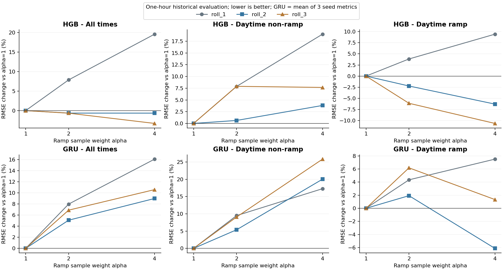
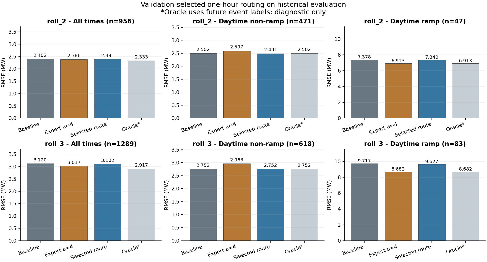

# station05 第五轮：突变加权损失与分类器路由

日期：2026-10-05。状态：已完成 36 个回归模型、4 个分类器及其校准器训练，模型重载、指标复核、图表检查和独立特征输入的示例推理。

## 结论

**加权 HGB 可以改善部分时段的突变预测，但直接替换基础模型会损害平稳场景；分类器路由保住了平稳 RMSE，只取得小幅收益。加权 GRU 没有形成可替换基线的稳定优势。**

按验证集预先确定的方案，在第二、第三历史评价区间，全天 RMSE 分别下降 **0.47%、0.57%**，突变 RMSE 分别下降 **0.52%、0.92%**。第一区间没有验证专家优势，按计划保留原 HGB，未训练路由。不能把加权专家单独使用时约 6%–11% 的评价突变改善，当作可实现的路由系统收益。

本轮不是新增独立 holdout，仍是 ERA5 valid-time 历史回顾实验。结果支持方法可执行及收益有代价，不足以宣称显著提升、实时预报效果或跨站泛化。

## 固定协议与研究依据

- 真正的回归基线：第二轮地表 HGB、第三轮地表 GRU；第四轮只提供场景定义。持续性预测继续保留。
- 未来 60 分钟终点功率，16 个 15 分钟历史输入，地表变量固定；没有添加气压层、更换输入或修改原始数据。
- GRU 保留 28 个输入槽、屏蔽未启用气压层字段后再拟合 scaler；7,169 参数，种子 17/42/2026。HGB 使用原有起点特征及历史功率滞后。两类模型的输入表示不同，分别对照各自未加权基线。
- 单层 GRU hidden32，残差预测，Adam lr=0.001、weight_decay=0.0001、批次256、梯度裁剪1、最多35 epoch、耐心7；仍以普通验证 RMSE 选 checkpoint。HGB 原参数保持不变。
- 三个时间前推区间不变：roll_1 评价 UTC 4/25–5/4；roll_2 5/11–5/20；roll_3 5/30–6/13。排除 UTC 5/31，删除跨缺口窗口。训练目标早于首次验证起点，验证目标早于首次评价起点。
- 突变标签：目标实测辐照 >20 W/m²，且 `abs(P_target-P_origin)>tau`。tau 只由各区间训练白天样本的绝对净变化 p90 确定。它识别一小时终点净变化，不覆盖全部区间内先升后降的波动。
- 权重 α=1/2/4；突变样本权重α，其他样本1，不重采样。GRU 使用批次内 `sum(w*error²)/sum(w)`，HGB 使用 sample_weight。监督标签可以使用未来实际值，模型输入及路由不能使用。
- 全局权重或路由选择：以验证突变 RMSE 最小为目标，同时全天及白天平稳 RMSE 均不超过基线的1.02倍。GRU 按三种子指标均值选权重。没有合格改进则回退未加权模型；这一约束没有包含夜间指标。

方法依据是[事件加权及辅助突变分类研究（2026）](https://doi.org/10.3390/app16168261)、[太阳功率突变分类研究（2018）](https://ieeexplore.ieee.org/document/8447599/)和[分类控制回归组合研究（2022）](https://www.mdpi.com/1996-1073/15/11/4171)。本项目的二专家路由是借鉴后的独立实验设计，预测时间、数据条件及指标与论文不同。完整研究边界见[研究与建议](突变路由与加权损失研究及实验建议_2026-10-05.md)。

| 区间 | 训练样本 | 训练白天突变样本 | tau（MW） |
|---|---:|---:|---:|
| roll_1 | 3949 | 189 | 8.459130 |
| roll_2 | 5485 | 264 | 8.290572 |
| roll_3 | 6829 | 337 | 8.237557 |

这些是窗口样本数，不是独立天气事件数。

## 第一阶段：加权损失

三种α × 三个区间 × 三个GRU种子，共27次GRU训练；HGB共9次。12个α=1模型数值复现原预测，最大差约3.55e-15 MW，为CSV浮点读写精度。

**所有区间、两种模型的全局选定权重均为α=1。** α=2/4均没有同时通过全天和平稳场景验证RMSE的2%约束。不能依据评价集恰好更好的结果，事后改选权重。

允许仅按验证突变误差挑选候选专家，再由路由约束普通场景：

| 区间 | 候选专家 | 基础HGB验证突变RMSE | 专家验证突变RMSE | 突变改善 | 是否进入路由 |
|---|---|---:|---:|---:|---|
| roll_1 | HGB α=1 | 7.6832 | 7.6832 | 0% | 否 |
| roll_2 | HGB α=4 | 6.8595 | 6.2305 | 9.17% | 是 |
| roll_3 | HGB α=4 | 6.7060 | 5.9621 | 11.09% | 是 |

最新区间的评价结果如下。GRU是三种子的平均RMSE，不是预测集成：

| 模型 | α | 全天RMSE | 白天平稳RMSE | 白天突变RMSE |
|---|---:|---:|---:|---:|
| HGB | 1 | 3.1199 | 2.7525 | 9.7169 |
| HGB | 2 | 3.0994 | 2.9698 | 9.1220 |
| HGB | 4 | 3.0174 | 2.9633 | 8.6815 |
| GRU | 1 | 3.2736 | 2.7438 | 10.2067 |
| GRU | 2 | 3.4995 | 2.9929 | 10.8376 |
| GRU | 4 | 3.6207 | 3.4525 | 10.3431 |

单位MW。HGB α=4的最新评价突变RMSE下降约10.65%，但平稳RMSE增加约7.66%；它在验证集已经未通过约束，所以只作为路由专家。GRU加权负结果保留，不追加围绕评价段的调参。

## 第二阶段：分类与硬/软路由

基础专家固定为未加权地表HGB，候选专家为对应区间HGB α=4。分类器比较带类别平衡的Logistic Regression和HGB，使用原有地表HGB特征，不使用目标功率、目标实测辐照或事后场景标签。

外层训练期按时间前80%拟合分类器、后20%拟合无类别加权的sigmoid校准器，边界清除4个预测间隔交叉样本。roll_2分类拟合4384、校准1097；roll_3拟合5459、校准1366。分类器scaler和类别权重只用拟合部分；事件阈值沿用外层训练定义。外层验证集用于最终路由选择，评价集不参与。

硬路由阈值0.10–0.90、步长0.05。软路由为 `(1-p)*base+p*expert`，不设硬阈值。两个分类器及全部路由候选统一按验证端到端功率指标选择，执行2%约束并包含基础模型回退项。

| 区间 | 验证选定方案 | 验证全天：基线→路由 | 验证平稳：基线→路由 | 验证突变：基线→路由 |
|---|---|---:|---:|---:|
| roll_2 | HGB分类器，硬路由η=0.15 | 2.3403→2.3272 | 2.7181→2.7141 | 6.8595→6.7614 |
| roll_3 | Logistic Regression，软路由 | 2.3295→2.3300 | 2.6211→2.6351 | 6.7060→6.6454 |

最新区间的验证全天和平稳指标略有恶化，分别约0.02%和0.53%，在预先允许的范围内；不能将其描述成验证所有指标均提升。

### 按验证方案固定后的历史评价

| 区间 | 场景 | 样本 | 基线RMSE | 选定方案RMSE | 改善 |
|---|---|---:|---:|---:|---:|
| roll_1 | 全天 | 956 | 2.8920 | 2.8920 | 0% |
| roll_1 | 白天平稳 | 438 | 3.8709 | 3.8709 | 0% |
| roll_1 | 白天突变 | 39 | 5.3343 | 5.3343 | 0% |
| roll_2 | 全天 | 956 | 2.4020 | 2.3906 | 0.47% |
| roll_2 | 白天平稳 | 471 | 2.5016 | 2.4907 | 0.44% |
| roll_2 | 白天突变 | 47 | 7.3782 | 7.3399 | 0.52% |
| roll_3 | 全天 | 1289 | 3.1199 | 3.1020 | 0.57% |
| roll_3 | 白天平稳 | 618 | 2.7525 | 2.7523 | 0.005% |
| roll_3 | 白天突变 | 83 | 9.7169 | 9.6271 | 0.92% |

最新区间快速上升RMSE为10.6001→10.4350 MW，下降为8.9818→8.9592 MW。夜间/低光RMSE为0.2183→0.2234 MW，增加约2.31%；平稳MAE为2.0380→2.0408 MW，也略有恶化。协议约束的是全天和平稳RMSE，不能隐去其他口径的代价。

Oracle使用真实未来标签选择专家，不能部署，也不是理论最优上界。最新评价区间其全天RMSE为2.9167 MW，突变为8.6815 MW；与实际选定路由的差距说明现有门控没有充分取得专家的突变收益。

### 分类能力与误报/漏报

- roll_2硬路由评价：PR-AUC（average precision）0.2332，事件频率0.0492；η=0.15时precision=26.92%、recall=14.89%，TP=7、FP=19、FN=40、TN=890。47个突变点只调用专家命中7个，40个漏报仍使用基础模型。
- 同一区间TP组平方误差合计下降26.49 MW²，FP组下降25.66 MW²，FN/TN组不变。分类误报不必然造成回归损失：两个专家并非严格只擅长各自类别；本轮误报组反而改善。逐组代价已保存，不能仅由分类错误计数推定预测损害。
- roll_3选定软路由的LR评价PR-AUC为0.3332，事件频率0.0644，Brier=0.0560。默认0.5二分类没有正预测，但软路由仍会按低概率给专家少量权重；默认阈值的零recall不能解释为软融合没有运行。表中的0.5仅用于分类诊断。
- 全部分类器的默认阈值指标、校准分箱、实际选定硬阈值指标，以及路由预测的分组平方误差均保留。校准期和评价期存在分布变化，sigmoid校准并不保证概率在新时段校准良好。

## 复现、检查与交付

[统一运行说明](../PVOD_Forecast/experiments/README_improvements_v5.md)提供依赖、单入口及分阶段命令。结果分开存于 `station05_weighted_loss_v5` 和 `station05_routing_v5`，未覆盖v1–v4。

核心证据：

- [固定加权协议](../PVOD_Forecast/results/station05_weighted_loss_v5/config.json)、[路由协议](../PVOD_Forecast/results/station05_routing_v5/config.json)、[训练阈值](../PVOD_Forecast/results/station05_weighted_loss_v5/training_thresholds.csv)。
- [权重选择](../PVOD_Forecast/results/station05_weighted_loss_v5/selection.json)、[路由准入](../PVOD_Forecast/results/station05_weighted_loss_v5/routing_gate.json)、[路由选择](../PVOD_Forecast/results/station05_routing_v5/selection.json)。
- [加权全指标](../PVOD_Forecast/results/station05_weighted_loss_v5/metrics.csv)、[同种子差异](../PVOD_Forecast/results/station05_weighted_loss_v5/paired_deltas.csv)、[路由全指标](../PVOD_Forecast/results/station05_routing_v5/metrics.csv)、[选定方案比较](../PVOD_Forecast/results/station05_routing_v5/selected_comparison.csv)。
- [校准分箱](../PVOD_Forecast/results/station05_routing_v5/calibration_bins.csv)、[选定分类指标](../PVOD_Forecast/results/station05_routing_v5/selected_classification_metrics.csv)、[误报漏报代价](../PVOD_Forecast/results/station05_routing_v5/selected_error_costs.csv)、[分类时间边界](../PVOD_Forecast/results/station05_routing_v5/classifier_split_audit.csv)。
- 各区间验证/评价逐点预测、每日MAE/RMSE、模型权重/scaler、分类器/校准器、训练过程、配置和文件哈希均已保存。验证集全部候选指标单独保存，以便审计选择过程。

独立复核已经运行：重算546行加权和672行路由MAE/RMSE；重载全部27个GRU、9个HGB，检查完整验证和评价预测；重载4个分类器及校准器、复核8组分类指标；复核缺口、阈值、scaler、时间边界、验证选模约束和硬/软/Oracle预测公式。最大重载差3.55e-15 MW。

[验证记录](../PVOD_Forecast/results/station05_weighted_loss_v5/validation_checks.json)和[基线复现记录](../PVOD_Forecast/results/station05_weighted_loss_v5/baseline_reproduction.json)已保存。另提供只读起点可用特征的推理入口，三个区间共9个示例与保存的选定预测完全一致；输入不需要目标功率或目标实测辐照。它是保存模型的推理示例，尚未建立实时天气获取和发布延迟处理链路。

两张最终图已实际打开检查。运行日志没有Warning或Traceback。

## 下一步

本轮完成了计划中的加权对照和条件触发的分类路由。无需立即增加更复杂门控或继续围绕已查看区间找最好参数。

1. 将原地表HGB保留为稳健基线，将当前路由保存为小幅改善的探索性候选；冻结协议后，用未使用的时间段或站点验证收益是否持续。不得根据新的评价误差改权重后又称它为独立验证。
2. 本轮专家有局部优势，但路由召回及概率泛化有限。后续若有额外数据，优先检查预测起点可获取的辐照变化、云运动或有明确发布时间的NWP能否补充事件信息。ERA5事后再分析不能直接替代实时预报。
3. 若实际目标改成“一小时内任意突变”或波动轨迹，再单列15/30/45/60分钟四步输出实验，重新定义区间事件与变化损失，不能与本轮终点净变化标签混用。
