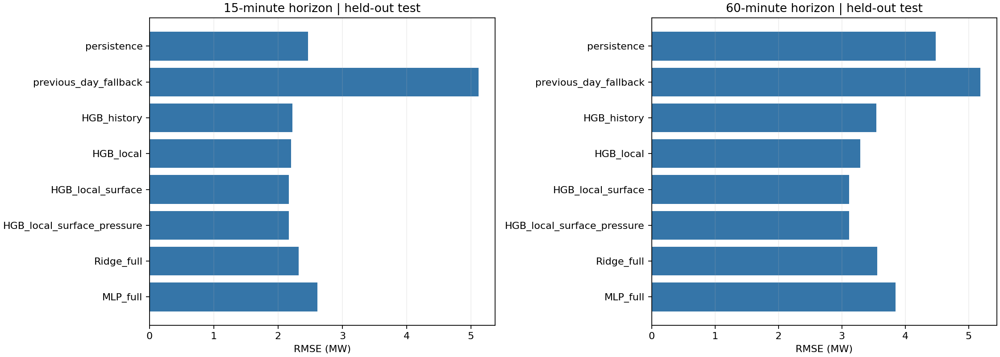
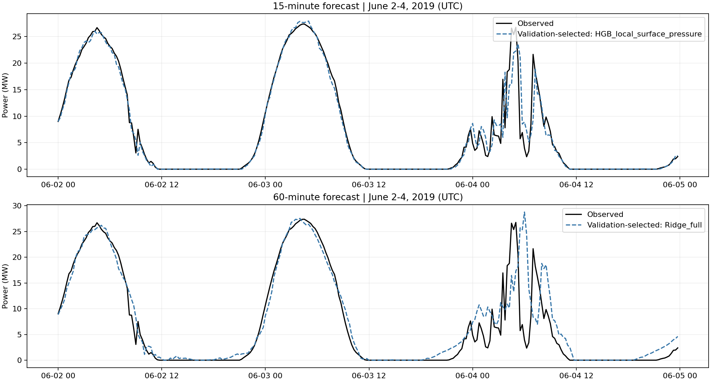

# station05 首轮光伏预测实验结果

后续进展：已完成 [第二轮 LSTM/GRU 与滚动验证](station05时序网络与滚动验证实验结果_2026-10-05.md)，新一轮进一步按预测起点检查标签可用性；本页保留首轮历史结果。

日期：2026-10-05。已从原始 CSV / NetCDF 完成构建、训练、评价、保存和复核。本轮为单站、单种子的历史回顾试验。

## 实验方法

任务是未来 15 分钟和 1 小时的功率预测。输入为起点和此前共 16 个观测（4 小时窗口）；时间为 UTC，功率为 MW。用持续性、前日基线、Ridge、直方图梯度提升树（HGB）、两层 MLP（64、32）对照。MLP 是本轮神经网络基线，原 LSTM 尚未重跑。

输入仅取起点或之前的功率和站点实测天气。ERA5 空间双线性插值至 station05，时间只取此前最近小时，不从未来小时插值。ERA5 是事后再分析，真实发布时间延迟未模拟，因此天气实验是回顾性特征研究，不能当作实时部署验证。PVOD NWP 缺发布时间，不纳入本轮。

ERA5 温度 K 转 °C，气压 Pa 转 hPa；辐射 ssrd/fdir 按小时能量除以 3600 得前一小时平均 W/m²，依据 [ECMWF ERA5 说明](https://confluence.ecmwf.int/pages/viewpage.action?pageId=414588701)。不能混用 ERA5-Land 每日累计差分规则。

UTC 2019-05-31 同步从所有输入和目标排除。保留规则时间网格，任何历史窗口或预测间隔跨缺口的样本均删除。原始数据未修改。

训练目标早于 2019-05-15；验证为 5 月 15 日至 5 月 30 日前；测试为 5 月 30 日及之后。scaler 只拟合训练集；MLP 按连续验证集 RMSE 保存最佳 epoch。特征/参数未用测试集选择。历史上下文允许来自此前集合，符合滚动预测。

所有模型在同一 horizon 使用相同样本。前日同刻功率缺失时回退到起点功率，标记为 previous_day_fallback。HGB 消融依次加入历史功率与时间、站点实测天气、ERA5 地表、ERA5 气压层；各组共享超参数。

## 固定切分与全天测试指标

表中时间均为 UTC；MAE、RMSE 单位 MW。

| Horizon (min) | Split | N | First target | Last target |
|---|---|---:|---|---|
| 15 | train | 6832 | 2019-03-04 20:00:00+00:00 | 2019-05-14 23:45:00+00:00 |
| 15 | validation | 1440 | 2019-05-15 00:00:00+00:00 | 2019-05-29 23:45:00+00:00 |
| 15 | test | 1296 | 2019-05-30 00:00:00+00:00 | 2019-06-13 15:45:00+00:00 |
| 60 | train | 6829 | 2019-03-04 20:45:00+00:00 | 2019-05-14 23:45:00+00:00 |
| 60 | validation | 1440 | 2019-05-15 00:00:00+00:00 | 2019-05-29 23:45:00+00:00 |
| 60 | test | 1293 | 2019-05-30 00:00:00+00:00 | 2019-06-13 15:45:00+00:00 |

| Model | 15-min MAE | 15-min RMSE | 15-min R2 | 60-min MAE | 60-min RMSE | 60-min R2 |
|---|---:|---:|---:|---:|---:|---:|
| persistence | 1.0498 | 2.4680 | 0.9234 | 2.5090 | 4.4792 | 0.7469 |
| previous_day_fallback | 2.3631 | 5.1187 | 0.6706 | 2.4607 | 5.1898 | 0.6603 |
| HGB_history | 0.8996 | 2.2240 | 0.9378 | 1.8214 | 3.5421 | 0.8417 |
| HGB_local | 0.8764 | 2.1993 | 0.9392 | 1.7151 | 3.2949 | 0.8631 |
| HGB_local_surface | 0.8639 | 2.1640 | 0.9411 | 1.5663 | 3.1183 | 0.8773 |
| HGB_local_surface_pressure | 0.8707 | 2.1658 | 0.9410 | 1.5561 | 3.1140 | 0.8777 |
| Ridge_full | 1.0080 | 2.3197 | 0.9323 | 1.9104 | 3.5591 | 0.8402 |
| MLP_full | 1.4290 | 2.6135 | 0.9141 | 2.1810 | 3.8465 | 0.8134 |

## 结果解读

- HGB_history 使用功率历史和时间；HGB_local 再加 LMD；HGB_local_surface 再加地表天气；HGB_local_surface_pressure 再加 500/850/1000 hPa 气压层。
- 15 分钟树模型加入地表特征后，测试 RMSE 从 2.1993 降至 2.1640 MW，降低约 1.60%；再加气压层为 2.1658 MW，略变差。
- 60 分钟树模型加入地表特征后，测试 RMSE 从 3.2949 降至 3.1183 MW，降低约 5.36%；再加气压层为 3.1140 MW，仅改善约 0.14%。目前不能认定气压层有显著或不可替代价值。
- 验证集选定的 15 分钟模型为 HGB_local_surface_pressure，测试 RMSE=2.1658 MW，相比持续性降低约 12.25%。验证集选定的 60 分钟模型为 Ridge_full，测试 RMSE=3.5591 MW，相比持续性降低约 20.54%。不能把查看测试后最优的树模型当作已经选定的交付模型。
- 测试表中 60 分钟全特征树模型相对持续性降低约 30.48%，是本轮对照发现；验证集选择与测试排序不同，提示短时间段分布变化，需要滚动验证。
- MLP 的 15 分钟 RMSE=2.6135 MW，高于持续性；60 分钟为 3.8465 MW，优于持续性但落后树模型。不能声称神经网络更优。最佳验证 epoch 分别为 26 和 16。

## 白天评价与预测曲线

白天按目标实测总辐照 >20 W/m² 定义，仅用于评价分层，不作为未来输入。全天含夜间零功率，因此同时报告白天误差。

| 提前量 | 白天样本 | 持续性 RMSE (MW) | 地表树模型 RMSE (MW) | 再加气压层 RMSE (MW) | MLP RMSE (MW) |
|---|---:|---:|---:|---:|---:|
| 15 分钟 | 708 | 3.3381 | 2.9273 | 2.9295 | 3.4811 |
| 60 分钟 | 705 | 6.0370 | 4.2183 | 4.2078 | 5.1599 |

固定展示 6 月 2–4 日 UTC；图只是三日示例，完整评价覆盖全部测试样本。平滑日跟踪较好，6 月 4 日快速变化存在明显错位。

## 运行证据与复现

- [脚本](../PVOD_Forecast/experiments/run_station05.py)、[方法与运行说明](../PVOD_Forecast/experiments/README.md)、[依赖版本](../PVOD_Forecast/experiments/requirements.txt)。
- [全部指标](../PVOD_Forecast/results/station05_v1/metrics.csv)、[配置](../PVOD_Forecast/results/station05_v1/config.json)、[源文件 SHA256 和运行版本](../PVOD_Forecast/results/station05_v1/manifest.json)。
- [15 分钟预测](../PVOD_Forecast/results/station05_v1/predictions_15min.csv)、[60 分钟预测](../PVOD_Forecast/results/station05_v1/predictions_60min.csv)、[MLP 训练历史](../PVOD_Forecast/results/station05_v1/mlp_training.csv)。
- 模型、scaler 和特征顺序均保存为 joblib；原始小时/对齐 15 分钟表、split、日志在同一结果目录。
- [复核记录](../PVOD_Forecast/results/station05_v1/validation_checks.json)：独立读取预测 CSV 重算验证/测试 RMSE 与样本数；所有预测有限，提前量正确，无跨缺口窗口。NumPy 2.0.2 初次出现矩阵运算警告，切换 1.26.4 后完整重跑，最终日志无运行警告。最终图已实际打开检查。

本次依赖位于 /tmp，是临时运行环境；持久复现可按 README 创建独立环境。再次运行同一版本会覆盖结果，请为后续实验创建新版本目录。

## 后续实验与限制

1. 在固定任务下重跑 LSTM/GRU，与 MLP/树模型比较，继续按验证集选模型。
2. 做滚动时间验证、多随机种子、按天误差差异分析，判断天气收益是否稳定。
3. 本轮测试集已经查看。若围绕其结果迭代，应标记为探索，并新增独立站点或时间段验证。现有 ERA5 仅覆盖 station05 所在区域，其他站点需先核实坐标。
4. 补气象发布时间、真实预报、测量延迟后再验证部署可用性。继续整理 ERA5 维度与单位技术说明。
5. 充电热实验需设备温度及功率工况或明确的公开/仿真路线。本轮不涉及充电热预测。

数据仅约 101 天、单站单种子，没有证明全年泛化或气压层因果作用。metadata 容量 35000 解释为 35 MW 仍需完整数据字典确认；因此同时保留不依赖容量的 MW 指标。历史 Notebook 的同期拟合及泄漏结果不与本轮超前预测直接比较。
