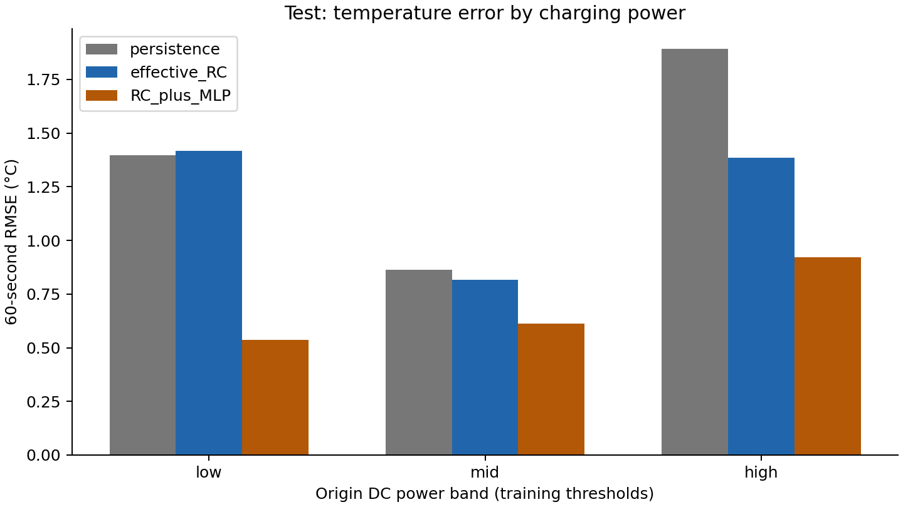
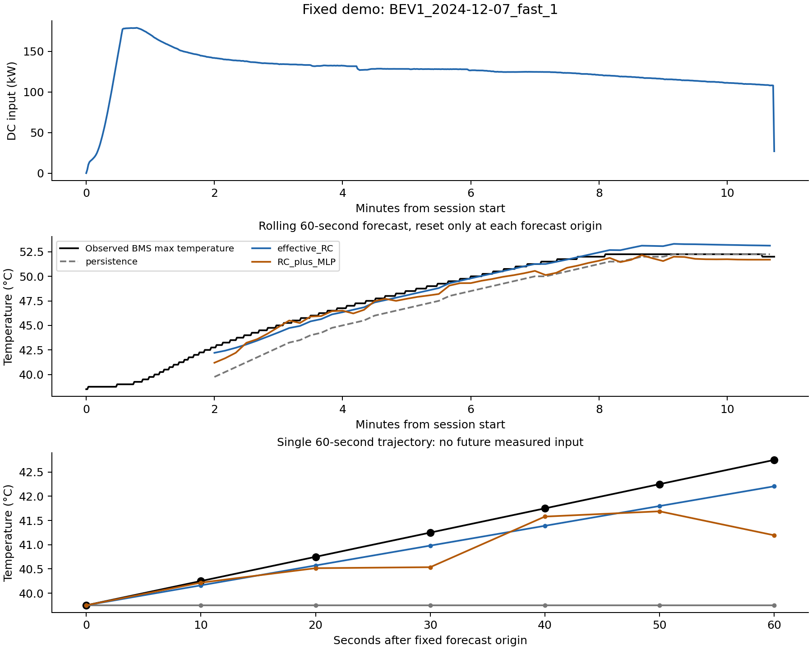

# 充电温度与功率工况：最小实验结果

日期：2026-10-07（新加坡时间）。状态：物理标定、两个小型网络候选、保存模型推理、指标复算和图表检查均已完成。本轮使用公开真实车辆快充数据，目标为 BMS 电池包最高温度；不是 Deye 充电模块实测。

## 1. 结论

在7次后续快充运行、753个测试窗口上，预测未来60秒温度，温度保持、有效 RC、RC＋MLP 的 RMSE 分别为 **1.416、1.209、0.708 °C**。RC＋MLP 相对 RC 的总体 RMSE 降低约41.4%，相对温度保持降低约50.0%。

这个总体收益并不表示每次运行都改善：混合模型只在7个测试批次中的3个优于 RC，另4个较差；历史温度平稳组中，温度保持优于另外两个模型。收益主要体现在升温组和部分误差较大的后期批次。此结果支持当前公开数据上的原型比较，不支持跨车辆、模块散热器或认证级安全结论。

按“物理模型＋神经网络＋不同功率比较＋误差分析＋可复现原型”的最小范围，本轮实验产物已齐备。公开电池包对象是否符合课程对原充电热主线的具体解释，仍应在最终范围说明中确认；没有把对象替换当作已获导师认可。

## 2. 数据与任务

数据来自 [KU Leuven / EnergyVille BEV energy dynamics V2](https://doi.org/10.48804/8KPDTW)，CC-BY-4.0。完整下载及基础质量检查见[准备报告](充电热实验数据准备结果_2026-10-07.md)。原始 ZIP 通过发布者 MD5；文件 SHA256 与各批次来源已保存。

25次快充、2个车辆标识，必要信号完整的记录为43,174条。温度标签为 `BMSmaxPackTemperature`，不是固定测温点；信号定义的分辨率为0.25 °C。负载使用电池电流，功率分组使用同步 DC 电压×电流，环境变量使用车端环境温度。

| 设置 | 冻结值 |
|---|---|
| 历史 | 最近60秒，61个连续1秒测量点 |
| 输出 | 未来10/20/30/40/50/60秒，共6个温度点 |
| 主指标 | 60秒终点 MAE/RMSE，单位 °C |
| 起点步长 | 10秒；窗口存在重叠 |
| 未来负载 | 起点电池电流保持；不读取未来实测电流或功率 |
| 未来环境温度 | 起点值保持 |
| 初始温度 | 每个窗口的起点实测温度；窗口内不再重置 |
| 测量延迟 | 假设为零，未模拟实际发布延迟 |
| 缺失 | 不补温度真值，不跨缺口、连续段或运行批次构造窗口 |
| 数据切分 | 同车同 UTC 日期不跨集合；按较早日期训练、后续日期验证/测试 |

训练/验证/测试为14/4/7次运行，对应2,317/923/753个预测窗口。两个车辆标识在三个集合中都出现，因此这是已见车辆的后续运行评价，不是跨车辆留出实验。753个重叠窗口不等于753次独立实验；同时提供按批次等权指标，未计算独立窗口假设下的显著性。

准备阶段已经查看整体数据覆盖、温度和功率范围；测试标签未用于拟合或本轮网络选择。这是预备审核后冻结划分的内部评价，不是外部新增盲测。

## 3. 模型与物理假设

### 温度保持

未来6个温度点均等于起点温度。这是短时温度变化较慢时的重要基线。

### 有效 RC

采用单节点有效热响应：

`dT/dt = a × (I_battery / 100 A)² − b × (T − Tamb)`

在每个预测窗口内保持 I 和 Tamb，解析解为：

`T(h) = Teq + (T0 − Teq) × exp(−b × h)`  
`Teq = Tamb + a × (I_battery / 100 A)² / b`

其中 a 为电流平方有效温升系数，b 为有效散热系数。电流符号保留，平方用于近似热源；没有把全部电功率 VI 当热源。模型忽略主动冷却、预热、电化学熵热及空间温差，且最高温度对应部位可能切换，所以只是有效基线。

只用训练运行拟合 a、b，目标为6个预测时刻的温度误差；各训练运行等权，避免长运行主导标定。a 限制为非负，b 限制为正。得到：

| 参数 | 标定值 |
|---|---:|
| a | 0.002619889 °C/s（电流归一化至100 A后平方） |
| b | 0.0001813784 s⁻¹ |
| 有效时间常数 1/b | 5,513.33秒，约91.89分钟 |

没有独立真实损耗或完整冷却输入，不能分别识别真实热阻、热容、电阻。时间常数是有效拟合结果，未做参数置信区间或结构辨识研究，不能当作设备规格。

### RC＋小型 MLP

MLP 输出真实温度与 RC 预测之差，最终温度为 RC＋预测残差。23个输入特征包括起点温度与环境温差、历史20/40/60秒温度变化、电池电流及 DC 功率的历史统计、SOC和电压、RC 的6步温升。

所有原始特征只取起点或之前。RC 的预测也是从起点信号生成。输入归一化和残差归一化只拟合训练集合；不使用尚未核实含义的 BMS 耗散字段或未来实测信号。

固定随机种子42，只比较两种隐藏层设置，最多250轮，连续25轮验证不改善则停止；验证按每个运行等权的60秒 RMSE 选择网络和轮次：

| 隐藏层 | 选定轮次 | 验证批次等权 RMSE °C | 是否选用 |
|---|---:|---:|---|
| 16、16 | 16 | 0.4078 | 否 |
| 32、32 | 13 | 0.3946 | 是 |

选定网络约2,022个可训练参数。没有在测试结果出来后继续搜索网络或增加路由。模型输出未裁剪。

三模型遵循相同预测信息可用性，但 RC 只使用其方程需要的起点信号，MLP 使用更丰富的历史特征。结果不能单独归因于“神经网络架构更好”。本轮也没有纯 MLP 消融，不能证明物理融合一定优于纯数据模型。

## 4. 总体结果

| 集合 | 模型 | 60秒 MAE °C | 60秒 RMSE °C | 批次等权 RMSE °C | 6步轨迹 RMSE °C |
|---|---|---:|---:|---:|---:|
| 验证 | 温度保持 | 0.7191 | 1.2294 | 1.1947 | 0.8106 |
| 验证 | 有效 RC | 0.5634 | 0.9428 | 0.8731 | 0.6249 |
| 验证 | RC＋MLP | 0.2801 | 0.4064 | 0.3946 | 0.2725 |
| 测试 | 温度保持 | 0.9890 | 1.4159 | 1.2750 | 0.9341 |
| 测试 | 有效 RC | 0.8360 | 1.2088 | 0.9915 | 0.7987 |
| 测试 | RC＋MLP | 0.5515 | 0.7084 | 0.6616 | 0.4514 |

测试 RC＋MLP 的60秒绝对误差95分位数为1.2811 °C，预测窗口内最高温度 MAE 为0.4006 °C。该峰值仅针对未来6个采样点，不代表整次充电峰值，也不构成安全阈值告警验证。

完整训练结果、逐批次指标和逐点预测见 `results/thermal_v1/`。

## 5. 不同功率及升降温工况

功率阈值仅从训练有效记录确定。按预测起点 DC 功率分档；未来实测功率不参与分组或推理。

| 起点功率组 | 测试窗口 / 运行数 | 温度保持 RMSE °C | RC RMSE °C | RC＋MLP RMSE °C |
|---|---:|---:|---:|---:|
| 低：大于1至68.84 kW | 223 / 5 | 1.3958 | 1.4174 | 0.5371 |
| 中：大于68.84至94.67 kW | 281 / 5 | 0.8623 | 0.8159 | 0.6124 |
| 高：大于94.67 kW | 241 / 5 | 1.8925 | 1.3861 | 0.9205 |
| 不超过1 kW | 8 / 1 | 0.6312 | 0.5302 | 0.7047 |

每个运行可跨多个功率组，运行数不能相加。低流量组只有一个运行的8个窗口，证据较少；混合模型在该组更差。本数据不是受控三档负载实验，SOC、初温、环境及未观测热管理会混杂，因此分组差异不是功率的因果效应。



升降温标签仅依据起点前60秒温度变化：大于0.25 °C为升温，小于−0.25 °C为降温，其余为历史平稳。没有用未来温度定义推理工况。

| 历史状态 | 测试窗口 | 温度保持 RMSE °C | RC RMSE °C | RC＋MLP RMSE °C |
|---|---:|---:|---:|---:|
| 升温 | 426 | 1.8450 | 1.5503 | 0.7951 |
| 平稳 | 295 | 0.3832 | 0.4655 | 0.5883 |
| 降温 | 32 | 0.7140 | 0.6265 | 0.4488 |

历史降温不等于停机自然冷却；车辆可能仍在充电并主动散热。实验没有独立、完整的停机冷却数据，不宣称已实测验证自然散热过程。

## 6. 逐批次负结果及误差解释

| 测试运行 | RC RMSE °C | RC＋MLP RMSE °C | 相对 RC |
|---|---:|---:|---|
| BEV1 2024-12-07 fast_1 | 0.6243 | 0.6951 | 恶化 |
| BEV1 2024-12-08 fast_1 | 0.4127 | 0.4603 | 恶化 |
| BEV2 2024-11-24 fast_1 | 0.1322 | 0.1581 | 恶化 |
| BEV2 2025-02-16 fast_1 | 0.7751 | 1.1060 | 恶化 |
| BEV2 2025-02-16 fast_2 | 1.2861 | 0.8287 | 改善 |
| BEV2 2025-04-05 fast_1 | 1.7969 | 0.8555 | 改善 |
| BEV2 2025-04-06 fast_1 | 1.9131 | 0.5278 | 改善 |

第一批次的固定 Demo 没有挑选最优案例：该批次混合模型总体不如 RC。总体误差降低集中在部分大误差批次。平稳组中不必要的残差修正可能增加误差，但具体原因未被消融或完整热管理日志确认；它是待验证解释。

固定 Demo 的单个窗口中，混合模型在50至60秒给出温度下降，而实际温度仍上升；因此终点总体误差改善不等于每个窗口的轨迹形状可靠。该观察是保留6步输出和逐窗曲线的用途之一，未据此重新调整模型。



全7批次曲线见[完整测试曲线](../results/thermal_v1/all_test_temperature_curves.png)。曲线是滚动60秒预测，每个预测窗口从当时温度开始，不能解释为从充电开始仅初始化一次后预测整次充电。

## 7. 物理与复现检查

已实际通过：

- RC 参数非负/正，零电流时从高于环境的初温向环境回落，同条件下较高电流平方不会给出较低 RC 温度。这是模型方程检查，非新增硬件试验。
- 模型重新加载后全部预测一致；误差复核最大差约7.1×10⁻¹⁵ °C。
- 独立入口重算总体、分功率、分批次和分阶段四张指标表，最大数值差约6.8×10⁻¹⁵。
- 归一化均值从训练数组重新计算匹配；原始清洗数据、划分和执行源文件哈希匹配。
- 历史输入入口得到的 Demo 与归档预测一致；把该起点之后的温度、功率和电流改成极端值，历史输入预测不变。
- 同一运行不跨训练/验证/测试；窗口不跨缺失时间；无测试后裁剪。

MLP 残差没有强制能量守恒或单调约束；RC 的物理检查不意味着整个混合模型在任意输入下都物理合理。保存的是已见数据范围内的实验模型，不是安全控制器。

## 8. Journal 1 交付对应与系统位置

| 承诺项 | 本轮证据 |
|---|---|
| 明确物理热假设及基线 | RC 方程、训练标定参数、适用边界和方程检查 |
| 神经网络温度结果 | 已训练小型残差 MLP、验证选择、权重、归一化参数 |
| 不同功率比较 | 固定训练阈值的低/中/高功率指标及图表 |
| 温度曲线与误差分析 | 全测试批次、历史升降温分组、负结果和峰值误差 |
| 可复现原型及 Demo | 下载/准备/实验/评价入口，配置哈希、固定历史输入和6步输出 |
| 热建模报告及系统叙事 | 本报告；供 Final Report、Journal 2 和展示引用 |

系统关系：光伏预测提供供电侧估计；热预测提供给定充电负载下的短时温度估计。二者可以供未来能量管理参考。本轮没有实施功率调度、PV到充电的自动联动或链上结算，也不把光伏功率直接视为电池热源。

因此可以将热主线作为公开电池包方法验证归档，同时在课程提交中明确测温对象。无需在本轮增加 PINN、多个时序网络或测试后路由，以免扩大此前要求的最小范围。

## 9. 复现入口与剩余边界

从仓库根目录运行：

```sh
OPENBLAS_NUM_THREADS=2 OMP_NUM_THREADS=2 .venv-thermal/bin/python Thermal_Prediction/src/run_thermal_v1.py
.venv-thermal/bin/python Thermal_Prediction/src/validate_thermal_v1.py
.venv-thermal/bin/python Thermal_Prediction/src/predict_thermal_v1.py --history Thermal_Prediction/results/thermal_v1/demo_history.csv --output Thermal_Prediction/results/thermal_v1/demo_cli_predictions.csv
.venv-thermal/bin/python Thermal_Prediction/src/plot_thermal_demo.py
```

运行实验会更新本轮结果，不覆盖原始数据和准备结果。复核入口不训练模型；推理只需61个连续历史点。依赖锁定见 `environment-lock.txt`，本轮实际环境 Python3.12.14，scikit-learn1.7.2、SciPy1.16.2。

结果和模型入口：[指标](../results/thermal_v1/metrics_overall.csv)、[逐点预测](../results/thermal_v1/predictions.csv)、[运行摘要](../results/thermal_v1/run_summary.json)、[检查](../results/thermal_v1/validation_checks.json)、[独立复核](../results/thermal_v1/independent_validation.json)、[物理参数](../models/thermal_v1/rc_parameters.json)。

局限：仅2个车辆标识、7个测试运行、一个种子；部分工况证据很少；未来功率保持是假设；最高电池温度和主动热管理难以用单节点完全描述；没有跨设备、新外部数据或模块实测验证。当前模型误差不是认证安全标准，也不承诺部署效果。最终课程文档和展示仍需把本报告整合进去。
